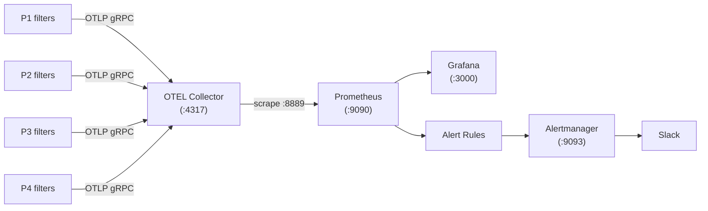
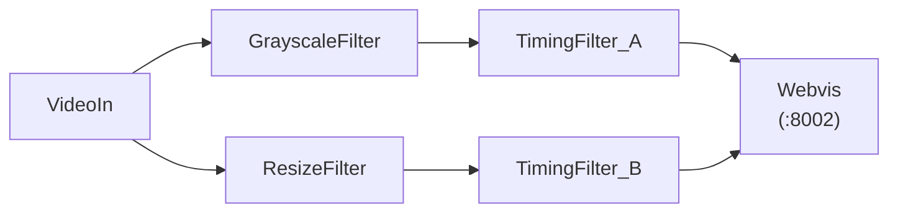
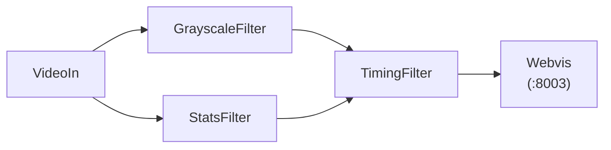
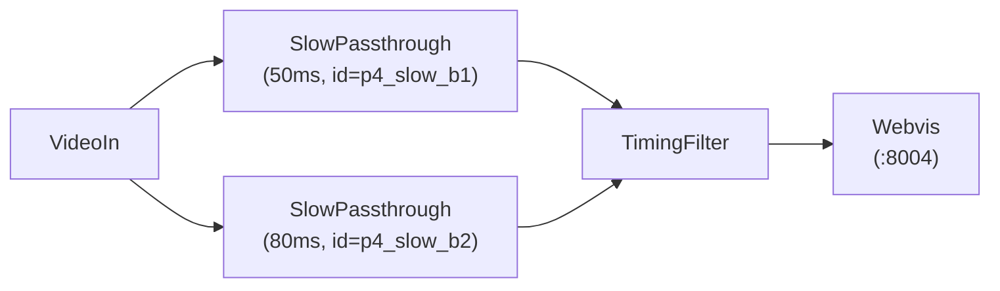

# Monitoring Demo

The monitoring demo is a full-stack observability example that runs four OpenFilter pipelines simultaneously and exposes all their metrics through a pre-built Grafana dashboard. It is the fastest way to see what OpenFilter produces in a real monitoring environment.

Every concept covered here maps to production: the same pipeline topologies, the same metrics, and the same Prometheus/Grafana/Alertmanager stack that you would deploy in any environment.

## What You Get

A single `make pipelines-up` command starts 25 Docker containers:

- Four video-processing pipelines (different topologies, described below)
- OTEL Collector, Prometheus, Alertmanager, and Grafana
- Four MJPEG web streams showing the processed video in real time

After approximately 70 seconds (first metric export cycle), the Grafana dashboard at http://localhost:3000 is fully populated.

## Architecture

Metrics flow from filters through the OTEL Collector into Prometheus. Grafana reads Prometheus. Alertmanager receives alert notifications from Prometheus and can route them to Slack.



Each filter exports metrics every 10 seconds via OTLP gRPC. The OTEL Collector exposes a Prometheus-compatible scrape endpoint on port 8889. Prometheus scrapes it every 10 seconds. This means metric data has up to 20 seconds of lag, and the very first export takes ~70 seconds after container startup.

## Quick Start

```bash
cd examples/monitoring-demo

# Build the local image and start all 4 pipelines + monitoring stack
make pipelines-up

# Wait ~70 seconds, then open:
#   Grafana dashboard:  http://localhost:3000  (admin / admin)
#   Prometheus:         http://localhost:9090
#   P1 video stream:    http://localhost:8001
#   P2 video stream:    http://localhost:8002
#   P3 video stream:    http://localhost:8003
#   P4 video stream:    http://localhost:8004

# Verify all four pipelines appear in Prometheus
make pipelines-verify

# Stop everything
make pipelines-down
```

## The Four Pipelines

All pipelines read the same looping video file at 5 fps. They run in parallel and each exports metrics independently to the shared monitoring stack. Each pipeline demonstrates a different real-world topology pattern.

### P1: transform-chain

`pipeline_id: transform-chain`


A linear chain. Frames flow through each stage in sequence: decode, convert to grayscale, resize, record timing metadata, display. This is the simplest topology and the baseline for understanding latency. Every filter sees every frame.

The end-to-end latency for this pipeline is roughly the sum of per-filter processing times plus ZMQ transmission overhead between stages.

### P2: fan-out

`pipeline_id: fan-out`



One source feeds two independent branches simultaneously. The same frame is broadcast to both `GrayscaleFilter` and `ResizeFilter` at the same time via ZMQ PUB/SUB. Each branch processes at its own speed. The sink (`Webvis`) merges them back, receiving frames from both under different topic names (`grayscale` and `resized`).

`TimingFilter_A` and `TimingFilter_B` are separate filters with separate `filter_id` values, so the Grafana dashboard shows independent per-filter metrics and independent end-to-end latency measurements for each branch.

### P3: diamond

`pipeline_id: diamond`



Fan-out at the source, fan-in at the merge point. Both branches process in parallel and `TimingFilter` waits for frames from both `GrayscaleFilter` and `StatsFilter` before emitting downstream. This is the standard pattern when you need to combine the outputs of two different analyses of the same frame (for example, a model result and a metadata enrichment step).

The key behavior to observe: end-to-end latency is determined by the *critical path*, meaning the slower branch. If `GrayscaleFilter` finishes in 3ms but `StatsFilter` takes 10ms, `TimingFilter` cannot emit until both arrive, so the total latency reflects the 10ms branch regardless of when the other finished.

### P4: diamond-same-class

`pipeline_id: diamond-same-class`



Same topology as P3 but both parallel branches use the same Python class (`SlowPassthrough`) with different `FILTER_ID` values and different artificial sleep durations (50ms and 80ms). This pipeline was created to expose and verify two specific bugs in the timing system.

**Bug 1 (metric label collision, fixed):** When two filters share the same class name, their Prometheus metrics previously collided into a single series because `filter_name` was identical and `filter_id` was not included in metric labels. After the fix, `p4_slow_b1` and `p4_slow_b2` appear as separate, distinguishable lines in all dashboard panels.

**Bug 2 (wrong fan-in critical path, fixed):** Before the fix, the end-to-end latency for fan-in pipelines was computed from the timing chain of whichever branch arrived first at the merge filter, which could be the *faster* branch rather than the critical path. After the fix, `_inject_timings` selects the chain with the latest `time_out` value across all input topics. In P4, you can verify this: the total latency is approximately 80ms higher than P1/P3 (matching the slower branch's sleep) rather than 50ms higher.

## The Grafana Dashboard

Open http://localhost:3000 (login: admin / admin). The dashboard named **OpenFilter Pipeline Monitor** is auto-provisioned on startup.

### Filtering by Pipeline

The **Pipeline** dropdown at the top of the dashboard controls which pipelines are shown across all panels. It defaults to **All**.

To focus on a single pipeline:
1. Click the **Pipeline** dropdown (top left)
2. Uncheck **All**
3. Select one pipeline, for example `diamond-same-class`

All panels update immediately. The variable is multi-select: you can pick two pipelines to compare them side by side.

### Overview Row

Quick health summary at a glance. Intended to answer "is anything on fire right now?"

| Panel | What it shows |
|-------|--------------|
| Active Pipelines | Count of distinct `pipeline_id` values currently exporting metrics. Drops to 0 if Prometheus has no recent data. |
| Total FPS | Sum of frames/second across all filter instances in the selected pipelines. |
| Camera Connected | Minimum of `openfilter_camera_connected` across all selected filters. Shows CONNECTED (green) or DISCONNECTED (red). |
| Disk Usage % | Current disk utilization. The test alert rule fires above 10%, the production rule above 90%. |
| RAM Usage % | System-level RAM. |
| GPU Accessible | Whether `nvidia-smi` returned a GPU. Always NO GPU on macOS; this is expected. |

### Throughput Row

Shows how many frames per second each filter is processing and whether any filter is falling behind.

**FPS per Filter:** One time-series line per filter instance, labeled with `FilterClass / filter_id (pipeline_id)`. In a healthy pipeline, all filters in the same pipeline run at the same FPS (5 fps in this demo). If one filter's line drops below the others, that filter is the bottleneck.

**Input / Output Latency:** `lat_in` is the time a frame spends waiting in the ZMQ queue before this filter picks it up. `lat_out` is the time to emit the frame downstream after processing. High `lat_in` at a particular filter means upstream is producing faster than that filter can consume.

**Frames Processed and Megapixels:** Cumulative counters that should grow at the same slope across all filters in the same pipeline. A filter with a slower slope is not keeping up and is dropping or skipping frames.

### End-to-End Timing Row

This is the most important section for understanding pipeline performance and for verifying the Bug 1 and Bug 2 fixes.

**Left panel: Per-Filter Process Time (ms, EMA)**

The time each filter's `process()` function takes, smoothed with an exponential moving average (alpha = 0.05). This measures only the time spent *inside* the filter doing work. It does not include queue wait time, ZMQ transmission, or OS scheduling.

Notable values in the demo:
- `VideoIn`: ~198ms (video decoding is the most expensive stage)
- `GrayscaleFilter`, `ResizeFilter`, `StatsFilter`: 2-5ms each
- `SlowPassthrough p4_slow_b1`: ~50ms (artificial sleep)
- `SlowPassthrough p4_slow_b2`: ~80ms (artificial sleep)
- `TimingFilter`, `Webvis`: near 0ms (passthrough)

When viewing P4 with the Pipeline filter, both `SlowPassthrough` instances appear as separate lines. This confirms the Bug 1 fix is working.

**Right panel: End-to-End Latency (ms, EMA)**

The full wall-clock time a frame takes from entering the source filter to exiting the sink (`Webvis`). This is measured at the sink, not computed by summing the left panel values. It is larger than that sum because it also includes ZMQ transmission time between filters, queue wait time at each stage, and OS scheduling overhead.

One series per pipeline, because each pipeline has one sink.

For fan-in pipelines (P3 and P4), this value reflects the critical path: the end-to-end time is determined by the slowest parallel branch, not the first to arrive. P4's total latency is approximately 280ms vs 200ms for P1/P2/P3, because its 80ms slow branch adds ~80ms to the base pipeline cost. This confirms the Bug 2 fix.

`total` = full frame journey time. `avg/stage` = mean of per-filter `process()` times. `std/stage` = standard deviation across stages (higher means one stage dominates).

**How to read both panels together:**

Select a single pipeline from the dropdown. The left panel tells you which individual filter is slow. The right panel tells you the downstream impact on the user-visible latency, including all the overhead the left panel does not capture. The gap between "sum of left panel values" and "right panel total" is the ZMQ and scheduling overhead for that topology.

### Resource Usage Row

**CPU % per Filter:** Per-process CPU including child threads. At 5 fps with simple transforms, all filters stay low. `VideoIn` is typically highest due to video decoding. A filter sustained near 100% CPU cannot keep up with the configured frame rate.

**Memory (GB) per Filter:** RSS memory footprint. Healthy filters show a flat line after startup. Slow steady growth over time indicates a memory leak.

### System Health Row

**Uptime:** How long each filter has been running, computed as `frames_processed / fps`. All lines should grow at the same rate in a healthy pipeline. A reset to zero means the filter process restarted.

**Firing Alerts:** A live table of Prometheus alerts currently in FIRING or PENDING state. In this demo, `GPUUnavailable` will always be firing on macOS (expected). `PipelineDown` fires if a pipeline stops sending metrics for 90 seconds.

## Metrics Reference

### Per-Filter System Metrics

These are exported by every filter independently. Prometheus lowercases all metric names from the OTEL export: `GrayscaleFilter` becomes `grayscalefilter_fps`, `SlowPassthrough` becomes `slowpassthrough_cpu`, etc. All carry labels `filter_name`, `filter_id`, `pipeline_id`, and `pipeline_instance_id`.

| Prometheus name pattern | Description |
|------------------------|-------------|
| `{filtername}_fps` | Current frames per second |
| `{filtername}_cpu` | Process CPU usage percent |
| `{filtername}_mem` | Process memory in GB |
| `{filtername}_lat_in` | Frame input queue wait time (ms) |
| `{filtername}_lat_out` | Frame output emit time (ms) |
| `{filtername}_frame_count_total` | Cumulative frames processed |
| `{filtername}_megapx_count_total` | Cumulative megapixels processed |
| `{filtername}_uptime_count_total` | Frames processed since startup (divide by fps for elapsed seconds) |

### Shared Timing Metrics

These use the `openfilter_` prefix and are emitted by the filter runtime for every filter automatically. No additional code is required in your filter to get them.

| Metric | Reported by | Description |
|--------|-------------|-------------|
| `openfilter_process_time_ms` | Every filter | `process()` duration, EMA-smoothed (alpha=0.05) |
| `openfilter_filter_time_in` | Every filter | Unix timestamp when frame entered the filter |
| `openfilter_filter_time_out` | Every filter | Unix timestamp when frame left the filter |
| `openfilter_frame_total_time_ms` | Sink only | Full pipeline wall-clock latency, EMA-smoothed |
| `openfilter_frame_avg_time_ms` | Sink only | Mean per-stage process time, EMA-smoothed |
| `openfilter_frame_std_time_ms` | Sink only | Std dev of per-stage process times, EMA-smoothed |

"Sink only" means the last filter in the pipeline. For linear topologies (P1), that is `Webvis`. For fan-in topologies (P3, P4), `Webvis` still acts as the sink, but the critical-path computation happens at the fan-in merge point (`TimingFilter`) before Webvis.

### System Health Metrics

Exported once per filter per export cycle. Represent host-level conditions, not per-filter conditions.

| Metric | Description |
|--------|-------------|
| `openfilter_camera_connected` | 1 = source delivering frames, 0 = source unavailable |
| `openfilter_disk_usage_percent` | Host disk usage (0-100) |
| `openfilter_ram_usage_percent` | Host RAM usage (0-100) |
| `openfilter_gpu_accessible` | 1 = CUDA GPU detected via nvidia-smi, 0 = not found |
| `openfilter_gpu_usage_percent` | GPU utilization from nvidia-smi (0 on macOS) |

### Frame Timing Metadata

In addition to Prometheus metrics, each frame carries a `filter_timings` list inside `frame.data['meta']`. This is populated by the runtime as the frame flows through the pipeline and is available to any filter's `process()` function.

```python
frame.data['meta']['filter_timings'] = [
    {
        "filter_name": "VideoIn",
        "filter_id":   "p3_video_in",
        "pipeline_id": "diamond",
        "time_in":     1772545691.023,   # Unix timestamp (seconds)
        "time_out":    1772545691.218,
        "duration_ms": 195.2
    },
    {
        "filter_name": "GrayscaleFilter",
        "filter_id":   "p3_grayscale",
        "pipeline_id": "diamond",
        "time_in":     1772545691.230,
        "time_out":    1772545691.233,
        "duration_ms": 3.1
    },
    ...
]
```

At fan-in merge points, the runtime compares `filter_timings` chains from all input topics and keeps the chain with the latest `time_out` (the critical path). This ensures the end-to-end latency metrics always reflect the slowest path through the pipeline.

## Alert Rules

Pre-configured in `docker/monitoring/alert-rules.yaml`. When `PipelineDown` fires it suppresses all other alerts for the same `pipeline_instance_id` (inhibition rule), because a down pipeline is the root cause of any camera/disk/GPU alerts from that pipeline.

| Alert | Condition | For | Severity | Notes |
|-------|-----------|-----|----------|-------|
| `PipelineDown` | No metrics received for 60s | 30s | critical | Suppresses all others for same pipeline |
| `CameraDisconnected` | `camera_connected == 0` | 30s | critical | |
| `DiskCritical` | `disk_usage_percent > 90` | 1m | warning | |
| `GPUUnavailable` | `gpu_accessible == 0` | 30s | critical | Always fires on macOS |
| `DiskCriticalTest` | `disk_usage_percent > 10` | 15s | warning | Test rule, fires on any non-empty disk |

### Expected Alert States on macOS

| Alert | Expected state | Reason |
|-------|---------------|--------|
| PipelineDown | inactive | Metrics arriving normally |
| CameraDisconnected | inactive | Video file delivers frames |
| DiskCritical | inactive | Disk typically well below 90% |
| DiskCriticalTest | firing | Any disk above 10% triggers it |
| GPUUnavailable | firing | No nvidia-smi on Mac |

### Slack Notifications

To receive Slack alerts, export `SLACK_WEBHOOK_URL` before starting the stack:

```bash
export SLACK_WEBHOOK_URL="https://hooks.slack.com/services/YOUR/WEBHOOK/URL"
make pipelines-up
```

Critical alerts (`severity: critical`) route to `#pipeline-alerts-critical`. All others route to `#pipeline-alerts`. Alerts do not re-notify for 4 hours (`repeat_interval: 4h`). To reset notification state, the Alertmanager container must be removed and recreated (not just restarted), because it persists notification history across restarts.

## Ports and Services

| Service | Port | URL |
|---------|------|-----|
| Grafana | 3000 | http://localhost:3000 (admin / admin) |
| Prometheus | 9090 | http://localhost:9090 |
| Alertmanager | 9093 | http://localhost:9093 |
| OTEL Collector gRPC | 4317 | (internal, OTLP endpoint) |
| OTEL Collector Prometheus exporter | 8889 | http://localhost:8889/metrics |
| P1 Webvis (transform-chain) | 8001 | http://localhost:8001 |
| P2 Webvis (fan-out) | 8002 | http://localhost:8002 |
| P3 Webvis (diamond) | 8003 | http://localhost:8003 |
| P4 Webvis (diamond-same-class) | 8004 | http://localhost:8004 |

## Custom Filters in the Demo

The demo includes four custom filters alongside the built-in `VideoIn` and `Webvis`. All live in `examples/monitoring-demo/filters/`.

| Filter | Class | What it does |
|--------|-------|-------------|
| `filters.grayscale` | `GrayscaleFilter` | Converts every frame to grayscale using OpenCV |
| `filters.resize` | `ResizeFilter` | Resizes frames to a fixed resolution |
| `filters.stats` | `StatsFilter` | Computes mean brightness per frame, logs every 30 frames |
| `filters.slow_passthrough` | `SlowPassthrough` | Passes frames through unchanged after sleeping for `SLEEP_MS` milliseconds (configurable via env var) |

`TimingFilter` (`timing_filter/filter.py`) is a passthrough that logs the full `filter_timings` chain from `frame.data['meta']` every 30 frames. It is the reference implementation for reading per-frame timing metadata from downstream.

## Adding Metrics to Your Own Filter

Any filter can declare custom metrics using `metric_specs`. The framework records them automatically on every frame without any code in `process()`.

```python
from openfilter.filter_runtime.filter import Filter, Frame
from openfilter.observability import MetricSpec

class MyDetectionFilter(Filter):
    metric_specs = [
        MetricSpec(
            name="detections_per_frame",
            instrument="histogram",
            value_fn=lambda d: len(d.get("detections", [])),
        ),
        MetricSpec(
            name="confidence",
            instrument="histogram",
            value_fn=lambda d: d.get("confidence", 0.0),
            boundaries=[0.5, 0.7, 0.8, 0.9, 0.95, 1.0],
        ),
    ]

    def process(self, frames: dict[str, Frame]) -> dict[str, Frame]:
        for topic, frame in frames.items():
            frame.data["detections"] = self._run_model(frame)
        return frames
```

These metrics appear in Prometheus under `mydetectionfilter_detections_per_frame` and `mydetectionfilter_confidence`, with the same `filter_id`, `pipeline_id`, and `pipeline_instance_id` labels as all other metrics from that filter.

See [observability.md](./observability.md) for the full MetricSpec reference, allowlist configuration, and OpenLineage integration.

## Makefile Reference

All commands run from `examples/monitoring-demo/`.

```bash
# Build and run
make pipelines-build      # Build openfilter-local:latest image
make pipelines-up         # Build image + start all 4 pipelines and monitoring
make pipelines-down       # Stop and remove all containers
make pipelines-status     # Show container status

# Logs
make pipelines-logs       # Follow all pipeline logs
make pipelines-logs-p1    # Follow P1 logs only
make pipelines-logs-p2    # Follow P2 logs only
make pipelines-logs-p3    # Follow P3 logs only
make pipelines-logs-p4    # Follow P4 logs only

# Verification
make pipelines-verify     # Confirm all 4 pipeline_ids appear in Prometheus

# Monitoring stack only (no pipelines)
make stack-up             # Start Prometheus, Grafana, OTEL, Alertmanager
make stack-down           # Stop monitoring stack
make stack-health         # Check health of all 4 monitoring services

# Alerts
make verify-alerts        # Check Alertmanager config and routing
make verify-alerts-test   # Verify + send a persistent test alert to Slack
make resolve-test-alert   # Resolve the manual test alert
make trigger-alert-gpu    # Trigger GPUUnavailable via a real pipeline
make trigger-alert-disk   # Trigger DiskCriticalTest via a real pipeline
make trigger-alert-camera # Inject a synthetic CameraDisconnected alert

# Single Python pipeline (no Docker needed for the filters)
make run                  # Run one pipeline for 120s with OTLP export
make run-console          # Run one pipeline printing metrics to stdout
```

## Troubleshooting

**No data in Grafana after 70 seconds**

Run `make pipelines-status` to confirm all containers are up, then `make pipelines-verify` to confirm Prometheus received metrics. If the monitoring stack was started separately from the pipelines (`make stack-up` followed by a separate `docker compose up`), the OTEL Collector may be on a different Docker network and cannot receive metrics. Use `make pipelines-up` (single compose file) to avoid this, or bridge the network manually:

```bash
docker network connect <pipeline-network> monitoring-demo-otel-collector-1 --alias otel-collector
```

**GPU alert always firing**

Expected on macOS. `nvidia-smi` is not available so `openfilter_gpu_accessible` is always 0.

**DiskCriticalTest alert always firing**

Expected. The test rule threshold is `disk_usage_percent > 10`, which fires on any machine with a non-empty disk. It exists to verify the alerting pipeline works end-to-end without needing a disk near capacity.

**Alertmanager keeps sending repeat Slack notifications**

The `repeat_interval` is 4 hours. If you need to reset notification state (for example after resolving an alert that Alertmanager already notified about), restart the container using `docker rm -f` followed by `make pipelines-up`, not just `docker restart`. Alertmanager persists notification history to disk across restarts.

**P4 latency looks the same as P1/P3**

Check that the Docker Compose file has `SLEEP_MS: "50"` and `SLEEP_MS: "80"` on `p4_slow_b1` and `p4_slow_b2` respectively. If the env var is missing, both branches default to 50ms and P4's latency will be indistinguishable from P3.
