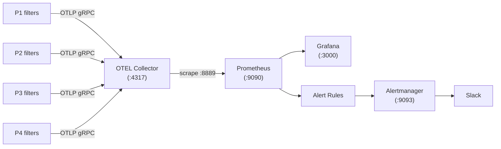
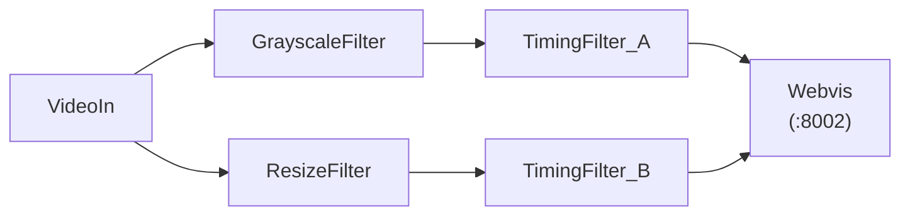
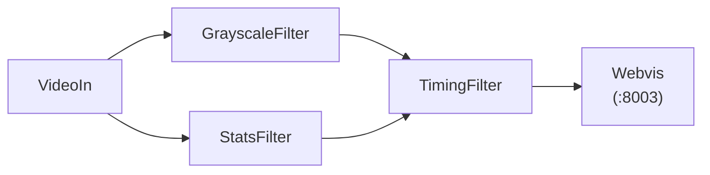
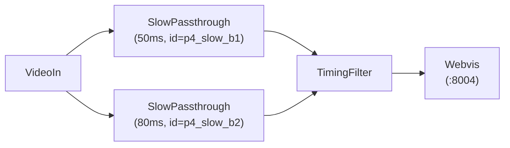
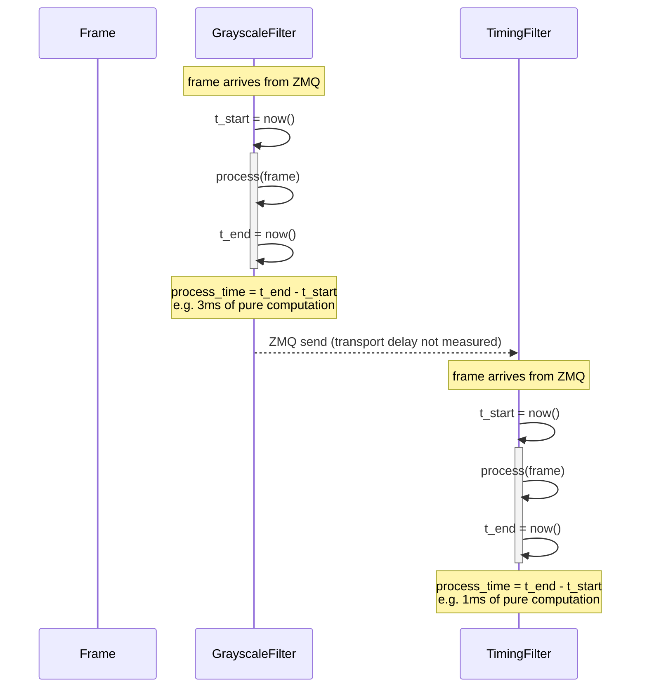
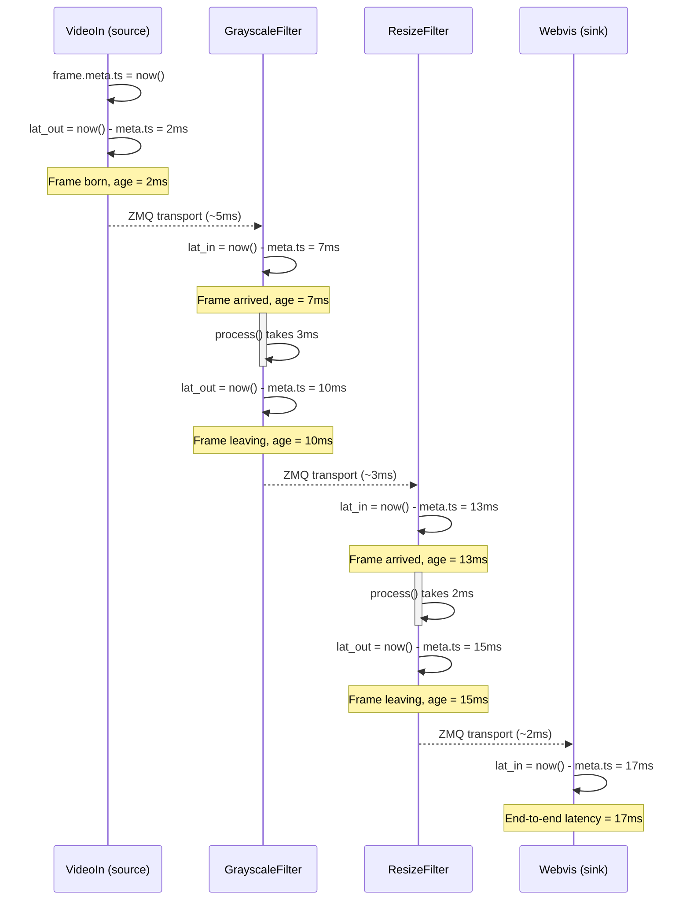
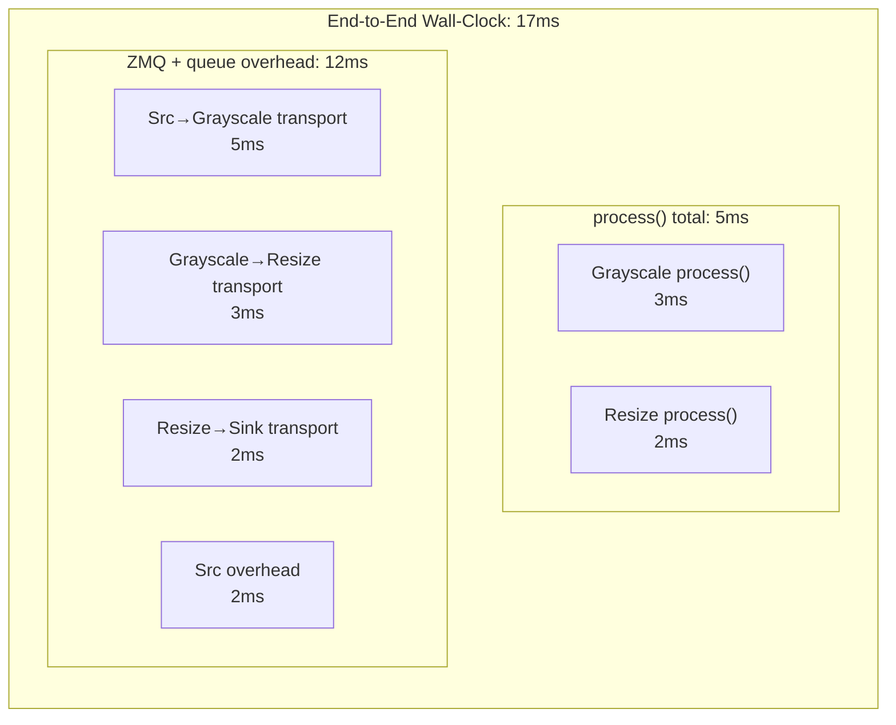
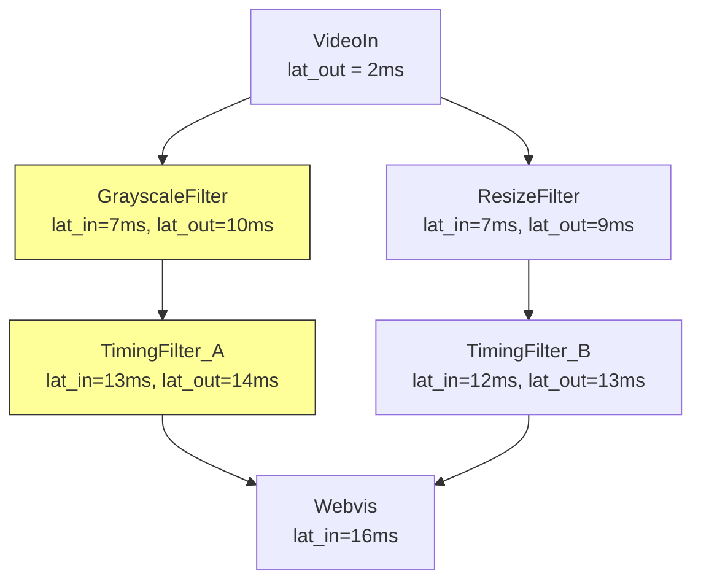

# Monitoring

The monitoring demo is a full-stack observability example that runs four OpenFilter pipelines simultaneously and exposes all their metrics through a pre-built Grafana dashboard. It is the fastest way to see what OpenFilter produces in a real monitoring environment.

Every concept covered here maps to production: the same pipeline topologies, the same metrics, and the same Prometheus/Grafana/Alertmanager stack that you would deploy in any environment.

## What You Get

A single `make pipelines-up` command starts 25 Docker containers:

- Four video-processing pipelines (different topologies, described below)
- OTEL Collector, Prometheus, Alertmanager, and Grafana
- Four MJPEG web streams showing the processed video in real time

After approximately 70 seconds (first metric export cycle), the Grafana dashboard at http://localhost:3000 is fully populated.

## Architecture

Metrics flow from filters through the OTEL Collector into Prometheus. Grafana reads Prometheus. Alertmanager receives alert notifications from Prometheus and can route them to Slack.



Each filter exports metrics every 10 seconds via OTLP gRPC. The OTEL Collector exposes a Prometheus-compatible scrape endpoint on port 8889. Prometheus scrapes it every 10 seconds. This means metric data has up to 20 seconds of lag, and the very first export takes ~70 seconds after container startup.

## Quick Start

```bash
cd examples/monitoring-demo

# Build the local image and start all 4 pipelines + monitoring stack
make pipelines-up

# Wait ~70 seconds, then open:
#   Grafana dashboard:  http://localhost:3000  (admin / admin)
#   Prometheus:         http://localhost:9090
#   P1 video stream:    http://localhost:8001
#   P2 video stream:    http://localhost:8002
#   P3 video stream:    http://localhost:8003
#   P4 video stream:    http://localhost:8004

# Verify all four pipelines appear in Prometheus
make pipelines-verify

# Stop everything
make pipelines-down
```

## The Four Pipelines

All pipelines read the same looping video file at 5 fps. They run in parallel and each exports metrics independently to the shared monitoring stack. Each pipeline demonstrates a different real-world topology pattern.

### P1: transform-chain

`pipeline_id: transform-chain`


A linear chain. Frames flow through each stage in sequence: decode, convert to grayscale, resize, record timing metadata, display. This is the simplest topology and the baseline for understanding latency. Every filter sees every frame.

**Filters:**
- **VideoIn** - Reads the looping video file and decodes each frame. The most expensive stage (~198ms per frame due to video decoding). Injects the initial `filter_timings` entry into every frame it emits.
- **GrayscaleFilter** - Converts each frame to grayscale using `frame.gray`. ~3ms per frame. Passes all metadata through unchanged.
- **ResizeFilter** - Resizes each frame to 320x240 using OpenCV. ~2ms per frame. Target resolution is configurable via `RESIZE_WIDTH` / `RESIZE_HEIGHT` env vars.
- **TimingFilter** - Pure passthrough. Performs no image transformation. Reads `frame.data['meta']['filter_timings']` and logs the full timing chain to stdout every 30 frames.
- **Webvis** - Serves the processed frames as a live MJPEG stream over HTTP on port 8001.

The end-to-end latency for this pipeline is roughly the sum of per-filter processing times plus ZMQ transmission overhead between stages.

### P2: fan-out

`pipeline_id: fan-out`



One source feeds two independent branches simultaneously. The same frame is broadcast to both `GrayscaleFilter` and `ResizeFilter` at the same time via ZMQ PUB/SUB. Each branch processes at its own speed. The sink (`Webvis`) merges them back, receiving frames from both under different topic names (`grayscale` and `resized`).

**Filters:**
- **VideoIn** - Decodes the video and broadcasts each frame to both branches simultaneously via ZMQ PUB/SUB. A single output port serves multiple subscribers with no extra configuration.
- **GrayscaleFilter** - Branch A. Converts frames to grayscale (~3ms).
- **ResizeFilter** - Branch B. Resizes frames to 320x240 (~2ms). Runs independently of the grayscale branch.
- **TimingFilter_A** (`id=p2_timing_a`) - Passthrough at the end of the grayscale branch. Acts as the sink for that branch, so it emits `openfilter_frame_total_time_ms` for the grayscale path.
- **TimingFilter_B** (`id=p2_timing_b`) - Passthrough at the end of the resize branch. Independent sink with its own end-to-end latency measurement.
- **Webvis** - Receives from both TimingFilter_A (topic `grayscale`) and TimingFilter_B (topic `resized`) and serves both streams.

`TimingFilter_A` and `TimingFilter_B` are separate filters with separate `filter_id` values, so the Grafana dashboard shows independent per-filter metrics and independent end-to-end latency measurements for each branch.

Webvis receives both topics and you can view each branch individually by appending the topic name to the URL:

| URL | What you see |
|-----|-------------|
| http://localhost:8002/grayscale | Grayscale branch only |
| http://localhost:8002/resized | Resized branch only |

This is a general Webvis feature: `http://localhost:<port>/<topic>` streams the MJPEG feed for any named topic. The root URL (`/`) shows whichever topic was received first.

### P3: diamond

`pipeline_id: diamond`



Fan-out at the source, fan-in at the merge point. Both branches process in parallel and `TimingFilter` waits for frames from both `GrayscaleFilter` and `StatsFilter` before emitting downstream. This is the standard pattern when you need to combine the outputs of two different analyses of the same frame (for example, a model result and a metadata enrichment step).

**Filters:**
- **VideoIn** - Decodes and broadcasts each frame to both branches.
- **GrayscaleFilter** - Branch A. Converts to grayscale (~3ms).
- **StatsFilter** - Branch B. Computes mean brightness per frame using `numpy.mean` (~3ms) and logs a running average every 30 frames. Passes the frame through unchanged. Represents a metadata enrichment step running in parallel with the image transform.
- **TimingFilter** (`id=p3_timing`) - Fan-in merge point. Receives from both branches (topics `grayscale` and `stats`). Waits for both to arrive before emitting. Selects the `filter_timings` chain from whichever branch had the latest `time_out`, ensuring end-to-end latency reflects the true critical path.
- **Webvis** - Serves the merged output on port 8003.

The key behavior to observe: end-to-end latency is determined by the *critical path*, meaning the slower branch. If `GrayscaleFilter` finishes in 3ms but `StatsFilter` takes 10ms, `TimingFilter` cannot emit until both arrive, so the total latency reflects the 10ms branch regardless of when the other finished.

### P4: diamond-same-class

`pipeline_id: diamond-same-class`



Same topology as P3 but both parallel branches use the same Python class (`SlowPassthrough`) with different `FILTER_ID` values and different artificial sleep durations (50ms and 80ms). This pipeline was created to expose and verify two specific bugs in the timing system.

**Filters:**
- **VideoIn** - Decodes and broadcasts each frame to both branches.
- **SlowPassthrough B1** (`id=p4_slow_b1`, `SLEEP_MS=50`) - Calls `time.sleep(0.050)` on every frame then passes it through unchanged. Represents a branch doing lightweight work, such as a fast model or a metadata lookup.
- **SlowPassthrough B2** (`id=p4_slow_b2`, `SLEEP_MS=80`) - Same class as B1, same code, but configured to sleep 80ms. This is the slower branch and therefore the critical path.
- **TimingFilter** (`id=p4_timing`) - Fan-in merge point. Waits for both branches, then selects the critical-path timing chain (from B2) for the end-to-end latency calculation.
- **Webvis** - Displays the merged output on port 8004.

**Bug 1 (metric label collision, fixed):** When two filters share the same class name, their Prometheus metrics previously collided into a single series because `filter_name` was identical and `filter_id` was not included in metric labels. After the fix, `p4_slow_b1` and `p4_slow_b2` appear as separate, distinguishable lines in all dashboard panels.

**Bug 2 (wrong fan-in critical path, fixed):** Before the fix, the end-to-end latency for fan-in pipelines was computed from the timing chain of whichever branch arrived first at the merge filter, which could be the *faster* branch rather than the critical path. After the fix, `_inject_timings` selects the chain with the latest `time_out` value across all input topics. In P4, you can verify this: the total latency is approximately 80ms higher than P1/P3 (matching the slower branch's sleep) rather than 50ms higher.

## How Time is Measured

There are two fundamentally different timing systems in the dashboard. Understanding the difference is critical for reading the charts correctly.

### process() time — stopwatch measurement

`process()` time is measured with a simple stopwatch inside each filter: start a timer before `process()`, stop it after. This measures **only CPU/GPU work** — no queue waits, no ZMQ transport.



The `openfilter_process_time_ms` metric and the "Per-Filter Process Time" chart show this. The `openfilter_frame_total_time_ms` metric sums these across all filters on the frame's path (e.g., 3 + 1 = 4ms total process time).

### Wall-clock latency (lat_in / lat_out) — frame age measurement

Wall-clock latency measures **how old the frame is** at each point. The video source stamps `frame.meta.ts = now()` once when the frame is created. Every downstream filter computes `now() - frame.meta.ts` to get the frame's age. This is cumulative and includes **everything**: queue waits, ZMQ transport, and processing.



### Comparing the two: where does the time go?



In this example:
- **Total process() time** = 3 + 2 = **5ms** (what the "End-to-End Timing" row shows)
- **End-to-end wall-clock** = **17ms** (what the "Wall-Clock Latency" row shows)
- **ZMQ + queue overhead** = 17 - 5 = **12ms** (what the "ZMQ + Queue Transit Overhead" chart shows)

### Fan-out: how wall-clock works with parallel branches

In a fan-out topology, multiple branches process the same frame in parallel. Each branch accumulates its own wall-clock latency independently.



Key observations:
- **Grayscale branch** (slightly longer): 14ms at TimingFilter_A lat_out
- **Resize branch** (fast): 13ms at TimingFilter_B lat_out
- **Webvis** sees 16ms because it receives frames from whichever branch completes first

## The Grafana Dashboard

Open http://localhost:3000 (login: admin / admin). The dashboard named **OpenFilter Pipeline Monitor** is auto-provisioned on startup.

### Filtering by Pipeline

The **Pipeline** dropdown at the top of the dashboard controls which pipelines are shown across all panels. It defaults to **All**.

To focus on a single pipeline:
1. Click the **Pipeline** dropdown (top left)
2. Uncheck **All**
3. Select one pipeline, for example `diamond-same-class`

All panels update immediately. The variable is multi-select: you can pick two pipelines to compare them side by side.

### Overview Row

Quick health summary at a glance. Intended to answer "is anything on fire right now?"

| Panel | What it shows |
|-------|--------------|
| Active Pipelines | Count of distinct `pipeline_id` values currently exporting metrics. Drops to 0 if Prometheus has no recent data. |
| Pipeline FPS | Frames per second at the video source (`filter_id=video_in`). This is the actual pipeline throughput — all downstream filters should match this. |
| Camera Connected | Minimum of `openfilter_camera_connected` across all selected filters. Shows CONNECTED (green) or DISCONNECTED (red). |
| Disk Usage % | Current disk utilization. The test alert rule fires above 10%, the production rule above 90%. |
| RAM Usage % | System-level RAM. |
| GPU Accessible | Whether `nvidia-smi` returned a GPU (uses `max()` so any GPU across filters is detected). Always NO GPU on macOS; this is expected. |

### Cumulative Counters Row

Three stat panels showing lifetime totals at the sink (Webvis):

| Panel | What it shows |
|-------|--------------|
| Frames Processed | Total frames processed at the Webvis sink since startup. |
| Megapixels Processed | Total megapixels at the Webvis sink. |
| System Uptime | How long the pipeline has been running (based on `uptime_count` metric). |

### Throughput Row

This row has the FPS timeseries on the left and 4 latency stat boxes on the right.

**FPS per Filter:** One auto-discovered time-series line per filter instance (query: `{__name__=~".+_fps"}`). In a healthy pipeline, all filters in the same pipeline run at the same FPS (5 fps in this demo). If one filter's line drops below the others, that filter is the bottleneck.

**Stat boxes (right half):**

| Box | What it shows |
|-----|---------------|
| **End-to-End Latency** | Current wall-clock latency from camera to display (`webvis_lat_in`). Green < 500ms, yellow 500-1000ms, red > 1000ms. |
| **Max Frame Age** | Worst-case frame age across all filters right now (`max(.+_lat_in)`). If much higher than E2E, a branch is lagging. |
| **Avg Frame Age** | Mean frame age across all filters (`avg(.+_lat_in)`). Useful baseline. |
| **Total process() Time** | Sum of CPU/GPU work on the critical path (`openfilter_frame_total_time_ms`). Compare with E2E to see how much is queue overhead. |

### End-to-End Timing Row

This section has two panels that measure `process()` time only (CPU/GPU work, not wall-clock).

**Left panel: Per-Filter Process Time (ms, EMA)**

The time each filter's `process()` function takes, smoothed with an exponential moving average (alpha = 0.05). This measures only the time spent *inside* the filter doing work. It does not include queue wait time, ZMQ transmission, or OS scheduling.

Notable values in the demo:
- `VideoIn`: ~198ms (video decoding is the most expensive stage)
- `GrayscaleFilter`, `ResizeFilter`, `StatsFilter`: 2-5ms each
- `SlowPassthrough p4_slow_b1`: ~50ms (artificial sleep)
- `SlowPassthrough p4_slow_b2`: ~80ms (artificial sleep)
- `TimingFilter`, `Webvis`: near 0ms (passthrough)

When viewing P4 with the Pipeline filter, both `SlowPassthrough` instances appear as separate lines. This confirms the Bug 1 fix is working.

**Right panel: Total Processing Time (sum of process(), EMA)**

The sum of all `process()` durations along the critical path. This is CPU/GPU work time only — does NOT include queue or transport delays between filters.

- `total process()` = sum of all `process()` times. This is the minimum possible E2E latency (if there were zero queue delays).
- `avg/stage` = mean per-filter time. Useful for capacity planning.
- `std/stage` = variability. High std means inconsistent processing (e.g., model inference jitter).

For fan-in pipelines (P3 and P4), this value reflects the critical path: the time is determined by the slowest parallel branch, not the first to arrive. P4's total is approximately 280ms vs 200ms for P1/P2/P3, because its 80ms slow branch adds ~80ms to the base pipeline cost. This confirms the Bug 2 fix.

**How to read both panels together:**

Select a single pipeline from the dropdown. The left panel tells you which individual filter is slow. The right panel tells you the total CPU/GPU cost. To see the full user-visible latency including queue overhead, look at the Wall-Clock Latency row below.

### Wall-Clock Latency Row

This is the most important section for understanding real-world pipeline performance. Unlike the "End-to-End Timing" row which only measures `process()` CPU/GPU time, these panels include **all** delays: ZMQ transport, queue waits, and processing.

**Key concept: `lat_in` vs `lat_out`**

Every filter stamps two wall-clock measurements:
- **`lat_in`** = `now() - frame.meta.ts` measured **before** `process()`. This is the frame's age when it arrives. Since `meta.ts` is set once at the source (VideoIn), `lat_in` is cumulative — it grows at each stage.
- **`lat_out`** = `now() - frame.meta.ts` measured **after** `process()`. The gap `lat_out - lat_in` for a single filter = that filter's `process()` time.

#### Wall-Clock End-to-End Latency (ms) — top left

Three lines:
- `Sink lat_in (end-to-end)` = frame age when it arrives at Webvis (the display sink). **This is the true user-facing latency.**
- `Max filter lat_out (last stage before sink)` = worst-case departure age across all processing filters (excluding video_in and webvis).
- `VideoIn lat_out (source baseline)` = frame age right after camera capture. Typically ~1-5ms.

How to read it:
- The vertical gap between VideoIn and Sink = total pipeline delay.
- If `Max filter lat_out` is **much higher** than `Sink lat_in`, a slow branch exists that doesn't block the display.
- If `Max filter lat_out` closely tracks `Sink lat_in`, the pipeline is well-balanced.

#### Per-Filter Frame Age (lat_in, ms) — top right

One auto-discovered line per filter showing frame age at arrival (query: `{__name__=~".+_lat_in"}`).

How to read by topology:

**Linear pipeline** (A -> B -> C -> D):
```
Lines form a staircase:
  A = 10ms
  B = 50ms   (A's process + ZMQ = 40ms)
  C = 120ms  (B's process + ZMQ = 70ms)
  D = 200ms  (C's process + ZMQ = 80ms)
```

**Fan-out pipeline** (A -> B, A -> C, B+C -> D):
```
B and C appear at similar heights (parallel), then D jumps higher.
If B=300ms and C=800ms, C is the bottleneck branch — D waits for C.
```

**Diamond pipeline** (A -> B -> D, A -> C -> D):
```
Same as fan-out. The merge point (D) shows lat_in = max of its inputs.
```

#### Per-Filter Departure Age (lat_out, ms) — bottom left

One auto-discovered line per filter showing frame age after `process()` (query: `{__name__=~".+_lat_out"}`).

Compare with the lat_in chart:
- Filter X: `lat_in=200ms`, `lat_out=275ms` -> it added **75ms** of `process()` time.
- Filter Y: `lat_in=200ms`, `lat_out=201ms` -> basically a passthrough (**1ms**).
- The highest line is the critical-path bottleneck.

#### ZMQ + Queue Transit Overhead (ms) — bottom right

Three lines:
- `Total pipeline delay` = `webvis_lat_in - videoin_lat_out` (full E2E minus source baseline)
- `Total process() time` = `openfilter_frame_total_time_ms` (sum of all `process()` on the frame's path)
- `ZMQ + queue overhead` = delay minus process() time (pure transport/queue cost)

How to read it:
- If `ZMQ + queue overhead` is flat and small, transport is healthy and `process()` dominates latency.
- If it trends upward, queues are backing up (filters can't consume fast enough).
- **Important caveat:** This metric reflects the path frames actually take to reach the sink (Webvis), i.e., the **fastest path** through the pipeline. If a slow branch exists but doesn't block the sink, it won't appear here. To spot slow branches, compare `Max filter lat_out` in the End-to-End panel with `Sink lat_in`.

### Resource Usage Row

**CPU % per Filter:** Per-process CPU including child threads (auto-discovered via `{__name__=~".+_cpu"}`). At 5 fps with simple transforms, all filters stay low. `VideoIn` is typically highest due to video decoding. A filter sustained near 100% CPU cannot keep up with the configured frame rate.

**Memory (GB) per Filter:** RSS memory footprint (auto-discovered via `{__name__=~".+_mem"}`). Healthy filters show a flat line after startup. Slow steady growth over time indicates a memory leak.

### System Health Row

**Firing Alerts:** A full-width live table of Prometheus alerts currently in FIRING or PENDING state. In this demo, `GPUUnavailable` will always be firing on macOS (expected). `PipelineDown` fires if a pipeline stops sending metrics for 90 seconds.

## Metrics Reference

### Per-Filter System Metrics

These are exported by every filter independently. Prometheus lowercases all metric names from the OTEL export: `GrayscaleFilter` becomes `grayscalefilter_fps`, `SlowPassthrough` becomes `slowpassthrough_cpu`, etc. All carry labels `filter_name`, `filter_id`, `pipeline_id`, and `pipeline_instance_id`.

| Prometheus name pattern | Description |
|------------------------|-------------|
| `{filtername}_fps` | Current frames per second |
| `{filtername}_cpu` | Process CPU usage percent |
| `{filtername}_mem` | Process memory in GB |
| `{filtername}_lat_in` | Frame age at arrival (ms) — `now - frame.meta.ts` before `process()` |
| `{filtername}_lat_out` | Frame age at departure (ms) — `now - frame.meta.ts` after `process()` |
| `{filtername}_frame_count_total` | Cumulative frames processed |
| `{filtername}_megapx_count_total` | Cumulative megapixels processed |
| `{filtername}_uptime_count_total` | Frames processed since startup (divide by fps for elapsed seconds) |

### Shared Timing Metrics

These use the `openfilter_` prefix and are emitted by the filter runtime for every filter automatically. No additional code is required in your filter to get them.

| Metric | Reported by | Description |
|--------|-------------|-------------|
| `openfilter_process_time_ms` | Every filter | `process()` duration, EMA-smoothed (alpha=0.05) |
| `openfilter_filter_time_in` | Every filter | Unix timestamp when frame entered the filter |
| `openfilter_filter_time_out` | Every filter | Unix timestamp when frame left the filter |
| `openfilter_frame_total_time_ms` | Sink only | Full pipeline wall-clock latency, EMA-smoothed |
| `openfilter_frame_avg_time_ms` | Sink only | Mean per-stage process time, EMA-smoothed |
| `openfilter_frame_std_time_ms` | Sink only | Std dev of per-stage process times, EMA-smoothed |

"Sink only" means the last filter in the pipeline. For linear topologies (P1), that is `Webvis`. For fan-in topologies (P3, P4), `Webvis` still acts as the sink, but the critical-path computation happens at the fan-in merge point (`TimingFilter`) before Webvis.

### System Health Metrics

Exported once per filter per export cycle. Represent host-level conditions, not per-filter conditions.

| Metric | Description |
|--------|-------------|
| `openfilter_camera_connected` | 1 = source delivering frames, 0 = source unavailable |
| `openfilter_disk_usage_percent` | Host disk usage (0-100) |
| `openfilter_ram_usage_percent` | Host RAM usage (0-100) |
| `openfilter_gpu_accessible` | 1 = CUDA GPU detected via nvidia-smi, 0 = not found |
| `openfilter_gpu_usage_percent` | GPU utilization from nvidia-smi (0 on macOS) |

### Frame Timing Metadata

In addition to Prometheus metrics, each frame carries a `filter_timings` list inside `frame.data['meta']`. This is populated by the runtime as the frame flows through the pipeline and is available to any filter's `process()` function.

```python
frame.data['meta']['filter_timings'] = [
    {
        "filter_name": "VideoIn",
        "filter_id":   "p3_video_in",
        "pipeline_id": "diamond",
        "time_in":     1772545691.023,   # Unix timestamp (seconds)
        "time_out":    1772545691.218,
        "duration_ms": 195.2
    },
    {
        "filter_name": "GrayscaleFilter",
        "filter_id":   "p3_grayscale",
        "pipeline_id": "diamond",
        "time_in":     1772545691.230,
        "time_out":    1772545691.233,
        "duration_ms": 3.1
    },
    ...
]
```

At fan-in merge points, the runtime compares `filter_timings` chains from all input topics and keeps the chain with the latest `time_out` (the critical path). This ensures the end-to-end latency metrics always reflect the slowest path through the pipeline.

## Alert Rules

Pre-configured in `docker/monitoring/alert-rules.yaml`. When `PipelineDown` fires it suppresses all other alerts for the same `pipeline_instance_id` (inhibition rule), because a down pipeline is the root cause of any camera/disk/GPU alerts from that pipeline.

| Alert | Condition | For | Severity | Notes |
|-------|-----------|-----|----------|-------|
| `PipelineDown` | No metrics received for 60s | 30s | critical | Suppresses all others for same pipeline |
| `CameraDisconnected` | `camera_connected == 0` | 30s | critical | |
| `DiskCritical` | `disk_usage_percent > 90` | 1m | warning | |
| `GPUUnavailable` | `gpu_accessible == 0` | 30s | critical | Always fires on macOS |
| `DiskCriticalTest` | `disk_usage_percent > 10` | 15s | warning | Test rule, fires on any non-empty disk |

### Expected Alert States on macOS

| Alert | Expected state | Reason |
|-------|---------------|--------|
| PipelineDown | inactive | Metrics arriving normally |
| CameraDisconnected | inactive | Video file delivers frames |
| DiskCritical | inactive | Disk typically well below 90% |
| DiskCriticalTest | firing | Any disk above 10% triggers it |
| GPUUnavailable | firing | No nvidia-smi on Mac |

### Slack Notifications

To receive Slack alerts, export `SLACK_WEBHOOK_URL` before starting the stack:

```bash
export SLACK_WEBHOOK_URL="https://hooks.slack.com/services/YOUR/WEBHOOK/URL"
make pipelines-up
```

Critical alerts (`severity: critical`) route to `#pipeline-alerts-critical`. All others route to `#pipeline-alerts`. Alerts do not re-notify for 4 hours (`repeat_interval: 4h`). To reset notification state, the Alertmanager container must be removed and recreated (not just restarted), because it persists notification history across restarts.

## Ports and Services

| Service | Port | URL |
|---------|------|-----|
| Grafana | 3000 | http://localhost:3000 (admin / admin) |
| Prometheus | 9090 | http://localhost:9090 |
| Alertmanager | 9093 | http://localhost:9093 |
| OTEL Collector gRPC | 4317 | (internal, OTLP endpoint) |
| OTEL Collector Prometheus exporter | 8889 | http://localhost:8889/metrics |
| P1 Webvis (transform-chain) | 8001 | http://localhost:8001 |
| P2 Webvis (fan-out) | 8002 | http://localhost:8002 |
| P3 Webvis (diamond) | 8003 | http://localhost:8003 |
| P4 Webvis (diamond-same-class) | 8004 | http://localhost:8004 |

## Custom Filters in the Demo

The demo includes four custom filters alongside the built-in `VideoIn` and `Webvis`. All live in `examples/monitoring-demo/filters/`.

| Filter | Class | What it does |
|--------|-------|-------------|
| `filters.grayscale` | `GrayscaleFilter` | Converts every frame to grayscale using OpenCV |
| `filters.resize` | `ResizeFilter` | Resizes frames to a fixed resolution |
| `filters.stats` | `StatsFilter` | Computes mean brightness per frame, logs every 30 frames |
| `filters.slow_passthrough` | `SlowPassthrough` | Passes frames through unchanged after sleeping for `SLEEP_MS` milliseconds (configurable via env var) |

`TimingFilter` (`timing_filter/filter.py`) is a passthrough that logs the full `filter_timings` chain from `frame.data['meta']` every 30 frames. It is the reference implementation for reading per-frame timing metadata from downstream.

## Adding Metrics to Your Own Filter

Any filter can declare custom metrics using `metric_specs`. The framework records them automatically on every frame without any code in `process()`.

```python
from openfilter.filter_runtime.filter import Filter, Frame
from openfilter.observability import MetricSpec

class MyDetectionFilter(Filter):
    metric_specs = [
        MetricSpec(
            name="detections_per_frame",
            instrument="histogram",
            value_fn=lambda d: len(d.get("detections", [])),
        ),
        MetricSpec(
            name="confidence",
            instrument="histogram",
            value_fn=lambda d: d.get("confidence", 0.0),
            boundaries=[0.5, 0.7, 0.8, 0.9, 0.95, 1.0],
        ),
    ]

    def process(self, frames: dict[str, Frame]) -> dict[str, Frame]:
        for topic, frame in frames.items():
            frame.data["detections"] = self._run_model(frame)
        return frames
```

These metrics appear in Prometheus under `mydetectionfilter_detections_per_frame` and `mydetectionfilter_confidence`, with the same `filter_id`, `pipeline_id`, and `pipeline_instance_id` labels as all other metrics from that filter.

See the `MetricSpec` class in `openfilter/observability/` for the full reference on custom metrics, allowlist configuration, and OpenLineage integration.

## Makefile Reference

All commands run from `examples/monitoring-demo/`.

```bash
# Build and run
make pipelines-build      # Build openfilter-local:latest image
make pipelines-up         # Build image + start all 4 pipelines and monitoring
make pipelines-down       # Stop and remove all containers
make pipelines-status     # Show container status

# Logs
make pipelines-logs       # Follow all pipeline logs
make pipelines-logs-p1    # Follow P1 logs only
make pipelines-logs-p2    # Follow P2 logs only
make pipelines-logs-p3    # Follow P3 logs only
make pipelines-logs-p4    # Follow P4 logs only

# Verification
make pipelines-verify     # Confirm all 4 pipeline_ids appear in Prometheus

# Monitoring stack only (no pipelines)
make stack-up             # Start Prometheus, Grafana, OTEL, Alertmanager
make stack-down           # Stop monitoring stack
make stack-health         # Check health of all 4 monitoring services

# Alerts
make verify-alerts        # Check Alertmanager config and routing
make verify-alerts-test   # Verify + send a persistent test alert to Slack
make resolve-test-alert   # Resolve the manual test alert
make trigger-alert-gpu    # Trigger GPUUnavailable via a real pipeline
make trigger-alert-disk   # Trigger DiskCriticalTest via a real pipeline
make trigger-alert-camera # Inject a synthetic CameraDisconnected alert

# Single Python pipeline (no Docker needed for the filters)
make run                  # Run one pipeline for 120s with OTLP export
make run-console          # Run one pipeline printing metrics to stdout
```

## CSV Metrics Export

Every sink (last) filter writes a flat CSV of compiled statistics every 60 seconds. In the monitoring demo this is already configured: each pipeline's webvis container has `FILTER_METRICS_CSV_PATH` set and the host directory `examples/monitoring-demo/metrics/` is mounted into the container.

### File locations on the host

After running `make pipelines-up`, CSV files appear here:

| Pipeline | Host path (relative to repo root) |
|----------|-----------------------------------|
| P1 transform-chain | `examples/monitoring-demo/metrics/p1_transform_chain.csv` |
| P2 fan-out | `examples/monitoring-demo/metrics/p2_fan_out.csv` |
| P3 diamond | `examples/monitoring-demo/metrics/p3_diamond.csv` |
| P4 diamond-same-class | `examples/monitoring-demo/metrics/p4_diamond_same_class.csv` |

After running `docker compose up` (single pipeline):

| Pipeline | Host path |
|----------|-----------|
| Single pipeline | `examples/monitoring-demo/metrics/openfilter_metrics.csv` |

The first row appears after 60 seconds. New rows are appended every 60 seconds thereafter. On shutdown the final flush captures any remaining buffered frames.

```bash
# Watch P1 rows arrive in real time:
tail -f examples/monitoring-demo/metrics/p1_transform_chain.csv
```

### Environment variables

The feature is controlled by two `FILTER_*` env vars set on the last-filter (webvis) service:

| Variable | Description |
|----------|-------------|
| `FILTER_METRICS_CSV_PATH` | Path to the CSV file inside the container. Removing this var disables the feature. |
| `FILTER_METRICS_CSV_INTERVAL` | Flush interval in seconds. Default: `60`. |

### CSV schema

Each row covers one flush window. For each metric family, five statistics are computed over the raw per-frame samples: `_avg`, `_std`, `_p95`, `_ci_lower`, `_ci_upper`. Fields that require at least 2 samples are left empty (not `NaN`) so the file opens cleanly in Excel and pandas.

| Column | Description |
|--------|-------------|
| `timestamp` | ISO-8601 UTC timestamp of the flush |
| `pipeline_id` | Value of `PIPELINE_ID` env var |
| `filter_id` | Value of `FILTER_ID` env var |
| `n_samples` | Number of frames accumulated in this window |
| `fps_avg / _std / _p95 / _ci_lower / _ci_upper` | Frames per second |
| `cpu_avg / ...` | CPU usage percent (process + children) |
| `mem_avg / ...` | Memory in GB (RSS, process + children) |
| `lat_in_ms_avg / ...` | Frame age at arrival in ms (EMA) |
| `lat_out_ms_avg / ...` | Frame age at departure in ms (EMA) |
| `process_time_ms_avg / ...` | Per-filter `process()` duration in ms (EMA) |
| `frame_total_time_ms_avg / ...` | Full end-to-end pipeline latency in ms (EMA) |
| `frame_avg_time_ms_avg / ...` | Mean per-stage process time in ms (EMA) |
| `frame_std_time_ms_avg / ...` | Std dev of per-stage process times in ms (EMA) |

### Notes

- Only the last filter (the one with no downstream outputs) writes CSV. In every pipeline topology in this demo that is the webvis container.
- All disk I/O happens in a background daemon thread so the frame-processing loop is never blocked.
- The CSV file is appended to, never overwritten. Delete or rotate the file between runs if needed.
- To use CSV export in your own pipeline, add `FILTER_METRICS_CSV_PATH` and a matching volume mount to whichever service is your sink filter.

## Troubleshooting

**No data in Grafana after 70 seconds**

Run `make pipelines-status` to confirm all containers are up, then `make pipelines-verify` to confirm Prometheus received metrics. If the monitoring stack was started separately from the pipelines (`make stack-up` followed by a separate `docker compose up`), the OTEL Collector may be on a different Docker network and cannot receive metrics. Use `make pipelines-up` (single compose file) to avoid this, or bridge the network manually:

```bash
docker network connect <pipeline-network> monitoring-demo-otel-collector-1 --alias otel-collector
```

**GPU alert always firing**

Expected on macOS. `nvidia-smi` is not available so `openfilter_gpu_accessible` is always 0.

**DiskCriticalTest alert always firing**

Expected. The test rule threshold is `disk_usage_percent > 10`, which fires on any machine with a non-empty disk. It exists to verify the alerting pipeline works end-to-end without needing a disk near capacity.

**Alertmanager keeps sending repeat Slack notifications**

The `repeat_interval` is 4 hours. If you need to reset notification state (for example after resolving an alert that Alertmanager already notified about), restart the container using `docker rm -f` followed by `make pipelines-up`, not just `docker restart`. Alertmanager persists notification history to disk across restarts.

**P4 latency looks the same as P1/P3**

Check that the Docker Compose file has `SLEEP_MS: "50"` and `SLEEP_MS: "80"` on `p4_slow_b1` and `p4_slow_b2` respectively. If the env var is missing, both branches default to 50ms and P4's latency will be indistinguishable from P3.
