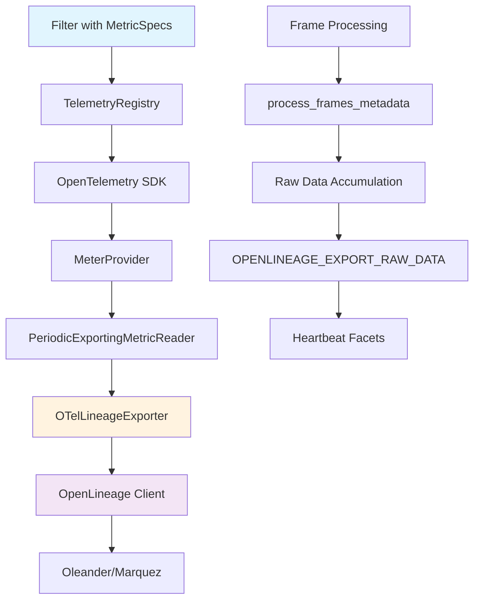
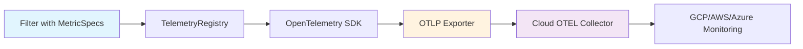

# OpenFilter Observability System

This document describes the comprehensive observability system in OpenFilter that provides safe, aggregated metrics without PII leakage, automatic histogram bucket generation, and optional raw data export.

## Architecture Overview



## Core Principles

1. **No PII in metrics** - Only numeric data leaves the process through the allowlist
2. **Declarative metrics** - Filters declare what they want to measure, not how
3. **Open standards** - Uses OpenTelemetry for collection and OpenLineage for export
4. **Automatic optimization** - Smart histogram bucket generation based on metric type
5. **Allowlist security** - Only explicitly approved metrics are exported
6. **Conditional initialization** - OpenLineage only starts when configured

## High-Level Flow

### OTEL-Only Mode

OpenFilter now supports **OTEL-only mode** for cloud deployments where you want to send metrics directly to OTEL collectors without OpenLineage:



**Key Features:**
- **Direct cloud integration** - Connect to GCP, AWS, Azure OTEL endpoints
- **Raw vs aggregated export** - Control processing via `export_mode`
- **Target selection** - Send to OTEL, OpenLineage, or both via `target`
- **Safe metrics** - Same allowlist security as OpenLineage mode

### 1. Filter Declaration

**Standard Mode (OpenLineage):**
```python
class MyFilter(Filter):
    metric_specs = [
        MetricSpec(
            name="frames_processed",
            instrument="counter",
            value_fn=lambda d: 1
        ),
        MetricSpec(
            name="detection_confidence",
            instrument="histogram",
            value_fn=lambda d: d.get("confidence", 0.0),
            num_buckets=8  # Auto-generate 8 buckets
        )
    ]
```

**OTEL-Only Mode:**
```python
class MyFilter(Filter):
    metric_specs = [
        MetricSpec(
            name="frames_processed",
            instrument="counter",
            value_fn=lambda d: 1,
            export_mode="raw",      # Send raw values directly
            target="otel"           # Only to OTEL collectors
        ),
        MetricSpec(
            name="detection_confidence",
            instrument="histogram",
            value_fn=lambda d: d.get("confidence", 0.0),
            export_mode="aggregated", # Let OTel SDK aggregate
            target="otel",           # Only to OTEL collectors
            num_buckets=10
        )
    ]
```

### 2. Frame Processing
```python
def process_frames_metadata(self, frames):
    # Automatic metric recording based on MetricSpecs
    if hasattr(self, '_telemetry_registry'):
        self._telemetry_registry.record_metrics(frames)
    
    # Optional raw data accumulation
    if self._export_raw_data and hasattr(self, 'emitter') and self.emitter is not None:
        # Accumulate frame data for potential export
        self._accumulate_raw_data(frames)
```

### 3. OpenTelemetry Processing
```python
# OpenTelemetry SDK handles metric collection and export
# - Counters: Running totals (monotonic values)
# - Histograms: Value distributions with bucket boundaries
# - Gauges: Current/latest values (non-monotonic)
```

### 4. Bridge Export
```python
class OTelLineageExporter(MetricExporter):
    def export(self, metrics_data, **kwargs):
        # Convert OpenTelemetry metrics to OpenLineage facets
        facets = {}
        for metric in metrics_data:
            if self._is_allowed(metric.name):  # Check allowlist
                # Convert histograms with numeric buckets/counts
                if metric.type == "histogram":
                    facets[f"{metric.name}_histogram"] = {
                        "buckets": [float(b) for b in metric.buckets],
                        "counts": [int(c) for c in metric.counts],
                        "count": metric.count,
                        "sum": metric.sum
                    }
        
        # Send to OpenLineage
        self._lineage.update_heartbeat(facets)
```

## Detailed Component Analysis

### MetricSpec Declaration

The `MetricSpec` dataclass provides a declarative way to define metrics:

```python
@dataclass
class MetricSpec:
    name: str                                    # Metric name
    instrument: str                              # 'counter', 'histogram', 'gauge'
    value_fn: Callable[[dict], Union[int, float, None]]  # Value extraction
    boundaries: Optional[List[Union[int, float]]] = None  # Custom histogram buckets
    num_buckets: int = 10                       # Auto-generated buckets
    export_mode: str = "aggregated"             # 'raw', 'aggregated', 'both'
    target: str = "both"                        # 'otel', 'openlineage', 'both'
    _otel_inst: Optional[Instrument] = None     # Internal OpenTelemetry instrument
```

#### New Fields (v0.2.0+)

**`export_mode`**: Controls how metrics are processed before export:
- `"raw"`: Send raw values directly to destination
- `"aggregated"`: Let OpenTelemetry SDK aggregate values first (default)
- `"both"`: Send both raw and aggregated values

**`target`**: Controls where metrics are sent:
- `"otel"`: Only to OpenTelemetry collectors (OTLP endpoints)
- `"openlineage"`: Only to OpenLineage systems (Oleander/Marquez)
- `"both"`: To both destinations (default)
```

#### Value Extraction Functions

```python
# Simple counter
value_fn=lambda d: 1

# Conditional counter
value_fn=lambda d: 1 if d.get("detections") else 0

# Array length
value_fn=lambda d: len(d.get("detections", []))

# Nested value
value_fn=lambda d: d.get("results", {}).get("confidence", 0.0)

# Computed value
value_fn=lambda d: d.get("processing_time", 0) * 1000  # Convert to ms
```

### Automatic Histogram Bucket Generation

The system automatically generates histogram buckets based on metric type:

```python
def generate_histogram_buckets(num_buckets: int, min_val: float = 0.0, max_val: float = 100.0):
    """Generate logarithmic bucket boundaries."""
    if min_val <= 0:
        min_val = 0.1  # Avoid log(0)
    
    num_boundaries = num_buckets - 1
    log_min = math.log(min_val)
    log_max = math.log(max_val)
    log_step = (log_max - log_min) / num_boundaries
    
    boundaries = []
    for i in range(num_boundaries):
        boundary = math.exp(log_min + i * log_step)
        boundaries.append(boundary)
    
    return boundaries
```

#### Bucket Generation by Metric Type

| Metric Name Pattern | Min | Max | Example Buckets |
|-------------------|-----|-----|-----------------|
| `*confidence*` | 0.0 | 1.0 | [0.1, 0.3, 0.5, 0.7, 0.9] |
| `*detection*` | 0.0 | 50.0 | [0.1, 0.5, 1.0, 2.0, 5.0, 10.0, 25.0] |
| `*time*` | 0.0 | 1000.0 | [1.0, 5.0, 10.0, 25.0, 50.0, 100.0, 250.0, 500.0] |
| `*size*` | 0.0 | 1.0 | [0.01, 0.05, 0.1, 0.2, 0.5, 0.8] |

### TelemetryRegistry

The `TelemetryRegistry` manages metric recording:

```python
class TelemetryRegistry:
    def __init__(self, metric_specs: List[MetricSpec]):
        self.meter = get_meter(__name__)
        self.specs = {}
        
        for spec in metric_specs:
            # Create OpenTelemetry instrument
            if spec.instrument == "counter":
                inst = self.meter.create_counter(spec.name)
            elif spec.instrument == "histogram":
                # Use provided boundaries or auto-generate
                boundaries = spec.boundaries or self._generate_buckets(spec)
                inst = self.meter.create_histogram(spec.name, boundaries=boundaries)
            elif spec.instrument == "gauge":
                inst = self.meter.create_observable_gauge(spec.name)
            
            spec._otel_inst = inst
            self.specs[spec.name] = spec
    
    def record_metrics(self, frames: Dict[str, Frame]):
        """Record metrics for all frames."""
        for frame_id, frame in frames.items():
            if hasattr(frame, 'data') and isinstance(frame.data, dict):
                for spec in self.specs.values():
                    value = spec.value_fn(frame.data)
                    if value is not None:
                        if spec.instrument == "counter":
                            spec._otel_inst.add(value)
                        elif spec.instrument == "histogram":
                            spec._otel_inst.record(value)
```

### Raw Data Export Flow

When `OPENLINEAGE_EXPORT_RAW_DATA=true`:

```python
# 1. Frame processing accumulates raw data
def process_frames_metadata(self, frames):
    if self._export_raw_data and hasattr(self, 'emitter') and self.emitter is not None:
        raw_frame_data = {}
        timestamp = time.time()
        
        for frame_id, frame in frames.items():
            if hasattr(frame, 'data') and isinstance(frame.data, dict):
                unique_key = f"{frame_id}_{self._frame_counter}"
                frame_data_copy = frame.data.copy()
                frame_data_copy.update({
                    '_timestamp': timestamp,
                    '_frame_id': frame_id,
                    '_unique_key': unique_key,
                    '_frame_number': self._frame_counter
                })
                raw_frame_data[unique_key] = frame_data_copy
                self._frame_counter += 1
        
        # Accumulate in emitter
        if not hasattr(self.emitter, '_last_frame_data'):
            self.emitter._last_frame_data = {}
        self.emitter._last_frame_data.update(raw_frame_data)
        
        # Limit stored frames to prevent memory issues
        if len(self.emitter._last_frame_data) > 100:
            keys_to_remove = list(self.emitter._last_frame_data.keys())[:-100]
            for key in keys_to_remove:
                del self.emitter._last_frame_data[key]

# 2. Bridge exports raw data in heartbeats
def export(self, metrics_data, **kwargs):
    facets = self._convert_metrics_to_facets(metrics_data)
    
    if self._export_raw_data and hasattr(self._lineage, '_last_frame_data'):
        raw_data = getattr(self._lineage, '_last_frame_data', {})
        if raw_data:
            facets["raw_subject_data"] = raw_data
            # Clear after sending to prevent memory buildup
            self._lineage._last_frame_data = {}
    
    return self._lineage.update_heartbeat(facets)
```

## Safe Metrics Allowlist System

### Purpose
The allowlist system controls exactly which metrics are exported to OpenLineage, providing security and reducing data volume. Only explicitly approved metrics leave the process.

### How It Works
1. **Metric Declaration**: Filters declare metrics via `MetricSpec` (e.g., `detection_confidence`)
2. **Allowlist Check**: During export, each metric name is checked against allowlist patterns
3. **Wildcard Support**: Patterns like `customprocessor_*` and `*_fps` are supported
4. **Histogram Naming**: For histograms, use base names (bridge adds `_histogram` suffix automatically)
5. **Export Control**: Only matching metrics are included in OpenLineage facets

### Examples

#### Basic Allowlist
```yaml
# safe_metrics.yaml
safe_metrics:
  - frames_processed           # Counter
  - frames_with_detections     # Counter  
  - detection_confidence       # Histogram (becomes detection_confidence_histogram)
  - processing_time_ms         # Histogram (becomes processing_time_ms_histogram)
```

#### Wildcard Patterns
```yaml
safe_metrics:
  - customprocessor_*          # All metrics starting with customprocessor_
  - "*_fps"                    # All metrics ending with _fps
  - "*_histogram"              # All histogram metrics
  - "detection_*"              # All detection-related metrics
```

#### All-in-One Configuration
```yaml
# OpenLineage Configuration
openlineage:
  url: "https://oleander.dev"
  api_key: "your_api_key"
  heartbeat_interval: 10

# Safe Metrics
safe_metrics:
  - frames_processed
  - detection_confidence
  - customprocessor_*
```

## Configuration Options

### OTEL-Only Configuration

For cloud deployments using OTEL collectors only:

#### Environment Variables
```bash
# Enable telemetry export
export TELEMETRY_EXPORTER_ENABLED=true
export TELEMETRY_EXPORTER_TYPE=otlp

# Cloud OTEL Collector
export OTEL_EXPORTER_OTLP_ENDPOINT=https://your-cloud-otel.com:4317
export OTEL_EXPORTER_OTLP_HEADERS="authorization=Bearer YOUR_TOKEN"
export OTEL_EXPORTER_OTLP_PROTOCOL=grpc

# Export settings
export OTEL_EXPORT_INTERVAL=30

# Safe metrics allowlist
export OF_SAFE_METRICS_FILE=safe_metrics_otel.yaml
```

#### YAML Configuration
```yaml
# safe_metrics_otel.yaml
opentelemetry:
  endpoint: "https://your-cloud-otel.com:4317"
  headers: "authorization=Bearer YOUR_TOKEN"
  protocol: "grpc"
  export_interval: 30
  enabled: true

safe_metrics:
  - "detections_per_frame"
  - "processing_time"
  - "fps"
  - "cpu"
  - "memory"
```

#### Cloud Provider Examples

**Google Cloud Platform:**
```bash
export OTEL_EXPORTER_OTLP_ENDPOINT=https://your-project.googleapis.com:4317
export OTEL_EXPORTER_OTLP_HEADERS="authorization=Bearer $(gcloud auth print-access-token)"
```

**AWS X-Ray:**
```bash 
export OTEL_EXPORTER_OTLP_ENDPOINT=https://your-region.awsxray.amazonaws.com:4317
export OTEL_EXPORTER_OTLP_HEADERS="x-aws-access-key-id=KEY,x-aws-secret-access-key=SECRET"
```

**Azure Monitor:**
```bash
export OTEL_EXPORTER_OTLP_ENDPOINT=https://your-workspace.azure.com:4317
export OTEL_EXPORTER_OTLP_HEADERS="x-api-key=YOUR_API_KEY"
```

### Environment Variables

#### Core Observability
```bash
# Enable/disable telemetry system
export TELEMETRY_EXPORTER_ENABLED=true

# Safe metrics allowlist - only these metrics are exported to OpenLineage
export OF_SAFE_METRICS="frames_processed,frames_with_detections,detection_confidence"

# Or use YAML file for complex patterns (recommended)
export OF_SAFE_METRICS_FILE=/path/to/safe_metrics.yaml
```

#### OpenLineage Integration
```bash
# Server configuration
export OPENLINEAGE_URL="https://oleander.dev"
export OPENLINEAGE_API_KEY="your_api_key"
export OPENLINEAGE_ENDPOINT="/api/v1/lineage"
export OPENLINEAGE_PRODUCER="https://github.com/PlainsightAI/openfilter"

# Heartbeat interval (seconds)
export OPENLINEAGE__HEART__BEAT__INTERVAL=10

# Optional: Export raw subject data (disabled by default)
export OPENLINEAGE_EXPORT_RAW_DATA=false
```

#### OpenTelemetry Export
```bash
# Export type: console, gcm, otlp_http, otlp_grpc, prometheus
export TELEMETRY_EXPORTER_TYPE=console
export EXPORT_INTERVAL=3000  # milliseconds

# For OTLP exporters (send to observability platforms)
export TELEMETRY_EXPORTER_OTLP_ENDPOINT="http://localhost:4317"  # gRPC endpoint
export OTEL_EXPORTER_OTLP_HTTP_ENDPOINT="http://localhost:4318"  # HTTP endpoint

# For Google Cloud Monitoring
export PROJECT_ID="your-gcp-project"

# For Prometheus
export PROMETHEUS_PORT=8888
```

## OTLP Integration

### Supported Platforms
OTLP (OpenTelemetry Protocol) allows sending metrics to various observability platforms:

- **Jaeger** - Distributed tracing
- **Grafana/Prometheus** - Metrics and dashboards  
- **Datadog** - Application monitoring
- **New Relic** - Full-stack observability
- **Honeycomb** - Observability for modern applications
- **Any OTEL Collector** - Gateway to multiple backends

### OTLP Configuration Examples

#### Jaeger (HTTP)
```bash
export TELEMETRY_EXPORTER_TYPE=otlp_http
export TELEMETRY_EXPORTER_OTLP_ENDPOINT="http://jaeger:14268/api/traces"
```

#### Grafana Cloud (gRPC)
```bash
export TELEMETRY_EXPORTER_TYPE=otlp_grpc
export TELEMETRY_EXPORTER_OTLP_ENDPOINT="https://otlp-gateway.grafana.net:443"
export OTEL_EXPORTER_OTLP_HEADERS="Authorization=Basic <base64-encoded-token>"
```

#### Local OTEL Collector
```bash
export TELEMETRY_EXPORTER_TYPE=otlp_grpc
export TELEMETRY_EXPORTER_OTLP_ENDPOINT="http://localhost:4317"
```

### YAML Configuration

```yaml
# safe_metrics.yaml
safe_metrics:
  - frames_*
  - *_histogram
  - *_counter
  - detection_confidence
  - processing_time_ms
  - memory_usage_mb
```

## Security Features

### 1. Allowlist Enforcement
```python
def _is_metric_allowed(self, metric_name: str) -> bool:
    """Check if metric is in allowlist."""
    if not self._safe_metrics:
        return False  # Lock-down mode
    
    for pattern in self._safe_metrics:
        if fnmatch.fnmatch(metric_name, pattern):
            return True
    
    return False
```

### 2. PII Prevention
- Only numeric values are exported
- No raw text, images, or structured data
- All values are aggregated (counters, histograms, gauges)
- Raw data export is optional and controlled

### 3. Runtime Validation
```python
def export(self, metrics_data, **kwargs):
    """Export metrics with validation."""
    facets = {}
    
    for metric in metrics_data.resource_metrics:
        for scope_metrics in metric.scope_metrics:
            for metric_data in scope_metrics.metrics:
                metric_name = metric_data.name
                
                # Validate against allowlist
                if not self._is_metric_allowed(metric_name):
                    logger.warning(f"Metric '{metric_name}' not in allowlist, skipping")
                    continue
                
                # Convert to facet
                facets[metric_name] = self._convert_metric_to_facet(metric_data)
    
    return facets
```

## Example Implementations

### Basic License Plate Detector
```python
from openfilter.filter_runtime.filter import Filter
from openfilter.observability import MetricSpec
import time

class LicensePlateDetector(Filter):
    metric_specs = [
        MetricSpec(
            name="frames_processed",
            instrument="counter",
            value_fn=lambda d: 1
        ),
        MetricSpec(
            name="frames_with_plates",
            instrument="counter",
            value_fn=lambda d: 1 if d.get("plates") else 0
        ),
        MetricSpec(
            name="plates_per_frame",
            instrument="histogram",
            value_fn=lambda d: len(d.get("plates", [])),
            num_buckets=8
        ),
        MetricSpec(
            name="detection_confidence",
            instrument="histogram",
            value_fn=lambda d: d.get("confidence", 0.0),
            num_buckets=8
        ),
        MetricSpec(
            name="processing_time_ms",
            instrument="histogram",
            value_fn=lambda d: d.get("processing_time", 0),
            num_buckets=10
        )
    ]
    
    def process(self, frames):
        for frame_id, frame in frames.items():
            start_time = time.time()
            
            # Process frame
            frame.data["plates"] = self._detect_plates(frame)
            frame.data["confidence"] = self._get_confidence(frame)
            frame.data["processing_time"] = (time.time() - start_time) * 1000
        
        return frames
```

### Advanced OCR Processor
```python
class OCRProcessor(Filter):
    metric_specs = [
        MetricSpec(
            name="frames_processed",
            instrument="counter",
            value_fn=lambda d: 1
        ),
        MetricSpec(
            name="frames_with_text",
            instrument="counter",
            value_fn=lambda d: 1 if d.get("ocr_text") else 0
        ),
        MetricSpec(
            name="text_length",
            instrument="histogram",
            value_fn=lambda d: len(d.get("ocr_text", "")),
            num_buckets=10
        ),
        MetricSpec(
            name="ocr_confidence",
            instrument="histogram",
            value_fn=lambda d: d.get("ocr_confidence", 0.0),
            boundaries=[0.0, 0.5, 0.7, 0.8, 0.9, 1.0]  # Custom buckets
        ),
        MetricSpec(
            name="memory_usage_mb",
            instrument="gauge",
            value_fn=lambda d: d.get("memory_usage", 0)
        )
    ]
```

## Usage Modes Summary

### 1. OpenLineage Only (Original)
- **Purpose**: Data lineage and metadata tracking
- **Configuration**: Set `OPENLINEAGE_URL` and `OPENLINEAGE_API_KEY`
- **MetricSpec**: Use default `target="both"` (treated as OpenLineage only)
- **Output**: Aggregated metrics in OpenLineage events
- **Use Case**: Data governance, pipeline monitoring

### 2. OTEL Only (New)
- **Purpose**: Cloud monitoring and alerting  
- **Configuration**: Set `OTEL_EXPORTER_OTLP_ENDPOINT` and disable OpenLineage
- **MetricSpec**: Use `target="otel"` and `export_mode="raw|aggregated|both"`
- **Output**: Metrics sent directly to cloud OTEL collectors
- **Use Case**: Production monitoring, alerting, cloud dashboards

### 3. Hybrid Mode  
- **Purpose**: Full observability stack
- **Configuration**: Set both OpenLineage and OTEL endpoints
- **MetricSpec**: Use `target="both"` with appropriate `export_mode`
- **Output**: Raw/aggregated to OTEL + aggregated to OpenLineage
- **Use Case**: Complete observability with lineage and monitoring

### 4. System Metrics Only
- **Purpose**: Basic infrastructure monitoring
- **Configuration**: Enable telemetry, no MetricSpecs needed
- **MetricSpec**: Not required (uses allowlist for system metrics)
- **Output**: FPS, CPU, memory metrics to configured destinations
- **Use Case**: Infrastructure monitoring without custom business metrics

## Expected Timeline

With default settings (`OPENLINEAGE__HEART__BEAT__INTERVAL=10`):

- **0-10 seconds**: Empty or minimal payloads (system warming up)
- **10-20 seconds**: Some metrics start appearing
- **20+ seconds**: Full metric payloads with meaningful data

This is normal behavior and ensures that metrics are properly aggregated before being sent to Oleander.

## Troubleshooting

### Common Issues

1. **No metrics appearing in Oleander**
   - Check `TELEMETRY_EXPORTER_ENABLED=true`
   - Verify `OF_SAFE_METRICS` includes your metric names
   - Ensure `OPENLINEAGE_URL` is set correctly

2. **Histogram bucket mismatch**
   - Verify `len(counts) = len(boundaries) + 1`
   - Check automatic bucket generation logic
   - Use `num_buckets` for auto-generation or `boundaries` for custom

3. **Raw data not appearing**
   - Set `OPENLINEAGE_EXPORT_RAW_DATA=true`
   - Check that frames have data in `frame.data`
   - Verify memory limits aren't exceeded

4. **OpenLineage not starting**
   - Ensure `OPENLINEAGE_URL` is set
   - Check API key and endpoint configuration
   - Verify network connectivity

### Debug Logging

Enable debug logging to trace metric flow:

```bash
export FILTER_DEBUG=true
export OPENLINEAGE_EXPORT_RAW_DATA=true
```

This will show:
- Metric recording events
- Raw data accumulation
- Bridge export operations
- OpenLineage heartbeat emissions

## Benefits

- **Standards compliance**: Uses OpenTelemetry for aggregation
- **Reusable**: Same declaration mechanism works for all filters
- **Safe**: Zero PII risk through allowlist and numeric-only export
- **Flexible**: Easy to add new metrics without code changes
- **Automatic**: Smart bucket generation and optimization
- **Optional**: Raw data export for debugging when needed
- **Conditional**: OpenLineage only starts when configured
- **Backward compatible**: Existing filters work without changes 


```shell
User sets OF_EXPORT_RAW_DATA=true
           ↓
Filter.__init__() reads env var → stores as self._export_raw_data
           ↓
Bridge.__init__() reads env var → stores as self._export_raw_data
           ↓
Frame processing → process_frames_metadata()
           ↓
if self._export_raw_data: copy frame.data → emitter._last_frame_data
           ↓
OpenTelemetry aggregation → Bridge.export()
           ↓
if self._export_raw_data: add raw_subject_data to facet
           ↓
OpenLineage heartbeat → Oleander receives raw data

```


```json
{
  "frames_processed": 150,
  "frames_with_detections": 89,
  "detections_per_frame_histogram": {...},
  "raw_subject_data": {
    "main": {
      "detections": [
        {
          "id": 0,
          "class": "person",
          "confidence": 0.85,
          "bbox": [0.1, 0.2, 0.3, 0.4]
        }
      ],
      "num_detections": 1,
      "avg_confidence": 0.85,
      "processing_time": 23.4,
      "size_ratio": 0.15,
      "timestamp": 1234567890.123
    }
  }
}
```


Expected Timeline
With default settings (OPENLINEAGE__HEART__BEAT__INTERVAL=10):
0-10 seconds: Empty or minimal payloads
10-20 seconds: Some metrics start appearing
20+ seconds: Full metric payloads with meaningful data
This is normal behavior and ensures that the metrics are properly aggregated before being sent to Oleander. The empty early events are just the system warming up!