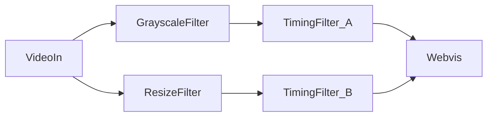
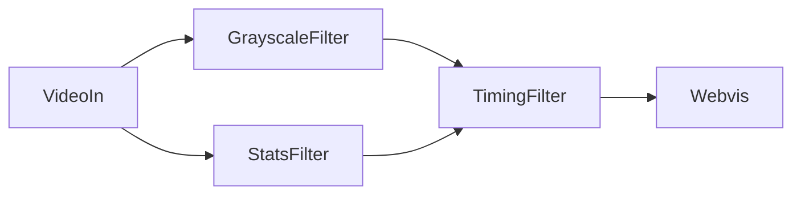
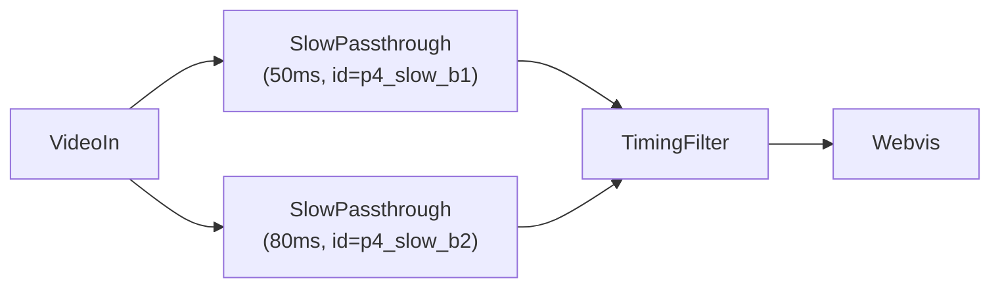
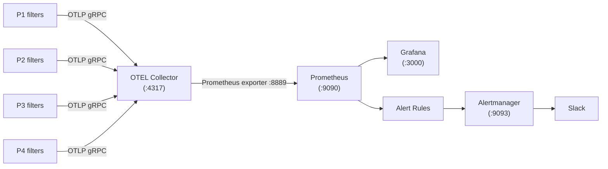

# Monitoring Demo

Run four OpenFilter pipelines simultaneously and observe their metrics in Prometheus, Grafana, and Alertmanager.

## Quick Start

```bash
cd examples/monitoring-demo

# Build the image + start all 4 pipelines and the monitoring stack
make pipelines-up

# Wait ~70 seconds for the first metrics export, then open:
#   Grafana:    http://localhost:3000  (admin / admin)
#   Prometheus: http://localhost:9090
#   P1 video:   http://localhost:8001
#   P2 video:   http://localhost:8002
#   P3 video:   http://localhost:8003
#   P4 video:   http://localhost:8004

# Verify all metrics landed in Prometheus
make pipelines-verify

# Tear down everything
make pipelines-down
```

## The Four Pipelines

All pipelines read the same looping video file at 5 fps. They run in parallel and each exports metrics independently to the same monitoring stack. Each represents a different real-world topology pattern.

### P1: transform-chain (linear)


The simplest topology. Frames flow through a single chain of transforms, one after the other. Each filter processes exactly one frame at a time before passing it downstream.

**Filters:**
- **VideoIn** - Reads the looping video file and decodes each frame. The most CPU-intensive stage (~198ms per frame). Adds `filter_timings` metadata to every frame it emits.
- **GrayscaleFilter** - Converts each frame to grayscale using `frame.gray`. Fast (~3ms). Passes all frame metadata through unchanged.
- **ResizeFilter** - Resizes each frame to 320x240 using OpenCV. Fast (~2ms). Target resolution is configurable via `RESIZE_WIDTH` / `RESIZE_HEIGHT` env vars.
- **TimingFilter** - Pure passthrough. Does no image transformation. Reads `frame.data['meta']['filter_timings']` and logs the full timing chain to stdout every 30 frames so you can inspect per-filter durations in the container logs.
- **Webvis** - Serves a live MJPEG stream over HTTP. Visit `http://localhost:8001` to watch the processed video in a browser.

**What to look for:** All filters show nearly identical FPS (they are all in the same chain, so if one slows down they all slow down). Per-filter process times are additive: the end-to-end latency roughly equals the sum of individual processing times plus ZMQ transmission overhead.

**Webvis:** http://localhost:8001

### P2: fan-out



One source feeding two independent branches simultaneously. The same frame goes to both branches at the same time. Each branch processes independently at its own speed. The sink (Webvis) merges them back, receiving frames from both.

**Filters:**
- **VideoIn** - Decodes the video and broadcasts each frame to both branches simultaneously via ZMQ PUB/SUB. A single output port serves multiple subscribers with no extra configuration.
- **GrayscaleFilter** - Branch A. Converts frames to grayscale (~3ms). Receives from VideoIn.
- **ResizeFilter** - Branch B. Resizes frames to 320x240 (~2ms). Also receives from VideoIn, independently.
- **TimingFilter_A** (`id=p2_timing_a`) - Passthrough at the end of the grayscale branch. Logs timing metadata. Acts as the sink for this branch, so it emits `openfilter_frame_total_time_ms` for the grayscale path only.
- **TimingFilter_B** (`id=p2_timing_b`) - Passthrough at the end of the resize branch. Same role as TimingFilter_A but for the resize path. Has its own independent end-to-end latency measurement.
- **Webvis** - Receives from both TimingFilter_A (as topic `grayscale`) and TimingFilter_B (as topic `resized`). Serves both streams.

**What to look for:** VideoIn FPS matches both branches (it broadcasts to both). TimingFilter_A and TimingFilter_B have separate process-time series and separate end-to-end latency measurements because they are independent sinks for their branch. The two branches may drift slightly in frame count if one is slower.

**Webvis:** http://localhost:8002 shows whichever topic arrives first by default. To see each branch separately, append the topic name to the URL:

| URL | What you see |
|-----|-------------|
| http://localhost:8002/grayscale | Grayscale branch only (from GrayscaleFilter) |
| http://localhost:8002/resized | Resized branch only (from ResizeFilter) |

This works for any Webvis instance: `http://localhost:<port>/<topic>` streams the MJPEG feed for that specific topic. The default URL (no path) shows whichever topic was received first.

### P3: diamond



Fan-out at the source and fan-in at the merge point. Both branches process in parallel and TimingFilter waits for both to arrive before emitting downstream. This is the classic diamond topology used when you need to combine the results of two different analyses of the same frame.

**Filters:**
- **VideoIn** - Decodes and broadcasts each frame to both branches at the same time.
- **GrayscaleFilter** - Converts frames to grayscale (~3ms). One of the two parallel branches.
- **StatsFilter** - Computes the mean brightness of each frame using `numpy.mean` (~3ms) and logs a running average every 30 frames. Passes the frame through unchanged. The other parallel branch.
- **TimingFilter** (`id=p3_timing`) - The fan-in merge point. Receives from both branches (as topics `grayscale` and `stats`). Waits for both to arrive before emitting. At this point the runtime selects the `filter_timings` chain from whichever branch had the latest `time_out`, ensuring end-to-end latency reflects the critical path, not the fastest branch.
- **Webvis** - Receives the merged output and serves the stream at http://localhost:8003.

**What to look for:** End-to-end latency on the right panel reflects the *critical path*, meaning the slower of the two branches determines the overall pipeline speed. If GrayscaleFilter takes 3ms and StatsFilter takes 10ms, the total latency includes the 10ms wait even though Grayscale finished earlier. The per-filter process times on the left show both branches separately.

**Webvis:** http://localhost:8003

### P4: diamond-same-class



Same topology as P3 but both parallel branches use the *same Python class* (`SlowPassthrough`) with different `FILTER_ID` values and different artificial sleep durations. This pipeline was created to expose and verify fixes for two bugs:

**Filters:**
- **VideoIn** - Decodes and broadcasts each frame to both branches.
- **SlowPassthrough B1** (`id=p4_slow_b1`, `SLEEP_MS=50`) - Calls `time.sleep(0.050)` on every frame, then passes it through unchanged. Represents a real-world filter that takes a fixed amount of time (e.g. a lightweight model inference).
- **SlowPassthrough B2** (`id=p4_slow_b2`, `SLEEP_MS=80`) - Same class as B1, same code, but sleeps for 80ms instead of 50ms. This is the slower branch and therefore the critical path.
- **TimingFilter** (`id=p4_timing`) - Fan-in merge point. Waits for both branches. The critical-path chain (from B2, the 80ms branch) is selected for the end-to-end latency calculation.
- **Webvis** - Displays the merged output at http://localhost:8004.

**Bug 1 (metric label collision, fixed):** When two filters share the same class name, they used to collide in Prometheus as a single metric series. After the fix, `p4_slow_b1` and `p4_slow_b2` appear as two separate lines in the Per-Filter Process Time panel.

**Bug 2 (wrong fan-in aggregate timing, fixed):** Before the fix, the end-to-end latency for the merged pipeline was measured from the *first* branch to arrive (50ms branch), not the slowest (80ms branch). After the fix, the total latency correctly reflects the critical path. You can verify this: P4's end-to-end latency (~280ms) is about 80ms higher than P1/P2/P3 (~200ms), exactly matching the slower branch's sleep.

**Webvis:** http://localhost:8004

## Grafana Dashboard

The dashboard is auto-provisioned at startup. Open http://localhost:3000 (admin / admin) and select **OpenFilter Pipeline Monitor**.

### Filtering by Pipeline

The **Pipeline** dropdown at the top of the dashboard controls which pipeline(s) are shown. It defaults to **All**. To focus on one pipeline:

1. Click the **Pipeline** dropdown (top left of the dashboard)
2. Uncheck **All**
3. Select a single pipeline (e.g. `diamond-same-class`)

All panels update immediately to show only that pipeline's data. The variable is multi-select, so you can compare two pipelines by selecting both.

### Dashboard Sections

#### Overview (top row)

Quick health summary. Shows active pipeline count, total FPS across all filters, camera connection status, disk usage, RAM usage, and GPU accessibility. On macOS, GPU will always show NO GPU (expected, no nvidia-smi).

#### Throughput

**FPS per Filter:** One line per filter instance. All filters in the same pipeline should hover at the same value (~5 fps in this demo). A line that drops below the others means that filter is the bottleneck.

**Input / Output Latency:** `lat_in` is how long a frame waits in the ZMQ queue before this filter picks it up. `lat_out` is the time to emit the frame downstream. High `lat_in` means upstream is pushing faster than this filter can consume.

**Frames Processed / Megapixels:** Cumulative counters that should increase at the same slope across all filters in the same pipeline. A filter with a slower slope is not keeping up with the frame rate.

#### End-to-End Timing

This section has two panels that measure different things.

**Left panel: Per-Filter Process Time (ms, EMA)**

The time each filter's `process()` function took, smoothed with an exponential moving average. This is the time spent *inside* the filter doing actual work. It does not include time waiting in queues or ZMQ transmission.

In P4, both `SlowPassthrough` instances (`p4_slow_b1` at ~50ms, `p4_slow_b2` at ~80ms) appear as separate lines. Without the Bug 1 fix they would have collapsed into a single line.

**Right panel: End-to-End Latency (ms, EMA)**

The full wall-clock time a frame takes from entering the source filter to exiting the sink (Webvis). This is measured at the sink, not computed by adding up the left panel values.

It is larger than the sum of per-filter process times because it also includes ZMQ transmission time between filters, queue wait times, and OS scheduling overhead. One series per pipeline (because there is one sink per pipeline).

For fan-in topologies (P3 diamond, P4 diamond-same-class), the total time reflects the *critical path*: the end-to-end latency is determined by the slowest parallel branch, not the first one to arrive.

`total` = full frame journey from source to sink.
`avg/stage` = mean of all per-filter process times for that pipeline.
`std/stage` = standard deviation across filter stages (higher means uneven stage times).

**How to compare them:** Select a single pipeline from the Pipeline dropdown. The left panel shows which individual filter is the bottleneck. The right panel shows the resulting impact on end-to-end latency, including all transmission overhead.

#### Resource Usage

**CPU % per Filter:** Per-process CPU usage. In this demo (5 fps, simple transforms) it stays low. VideoIn is typically the highest due to video decoding. If a filter hits near 100%, it cannot keep up with the configured frame rate.

**Memory (GB) per Filter:** RSS memory footprint. Slow steady growth over time suggests a memory leak in that filter.

#### System Health

**Uptime:** How long each filter has been running, computed as `frames_processed / fps`. All lines should grow at the same rate. A reset to zero means the filter process restarted.

**Firing Alerts:** Active Prometheus alerts. On macOS the `GPUUnavailable` alert will always be firing (no nvidia-smi available). `PipelineDown` fires if any pipeline stops sending metrics for 90 seconds.

## Metrics Reference

### Per-Filter Metrics

These are reported by every filter independently. All have labels: `filter_name`, `filter_id`, `pipeline_id`.

| Prometheus Name | Description |
|-----------------|-------------|
| `{filtername}_fps` | Frames per second |
| `{filtername}_cpu` | CPU usage percent |
| `{filtername}_mem` | Memory in GB |
| `{filtername}_lat_in` | Input queue wait time (ms) |
| `{filtername}_lat_out` | Output emit time (ms) |
| `{filtername}_frame_count_total` | Cumulative frames processed |
| `{filtername}_megapx_count_total` | Cumulative megapixels processed |
| `{filtername}_uptime_count_total` | Frames processed since startup (divide by fps for seconds) |

Note: Prometheus lowercases all metric names. `GrayscaleFilter` becomes `grayscalefilter`, `SlowPassthrough` becomes `slowpassthrough`, etc.

### Shared Timing Metrics

These use the `openfilter_` prefix and are emitted by the filter runtime for all filters.

| Metric | Reported By | Description |
|--------|-------------|-------------|
| `openfilter_process_time_ms` | Every filter | process() duration, EMA-smoothed |
| `openfilter_filter_time_in` | Every filter | Unix timestamp when frame entered the filter |
| `openfilter_filter_time_out` | Every filter | Unix timestamp when frame left the filter |
| `openfilter_frame_total_time_ms` | Sink only | Full pipeline wall-clock latency, EMA-smoothed |
| `openfilter_frame_avg_time_ms` | Sink only | Mean per-stage process time, EMA-smoothed |
| `openfilter_frame_std_time_ms` | Sink only | Std dev of per-stage process times, EMA-smoothed |

### System Health Metrics

| Metric | Description |
|--------|-------------|
| `openfilter_camera_connected` | 1 = source delivering frames, 0 = disconnected |
| `openfilter_disk_usage_percent` | Host disk usage (0-100) |
| `openfilter_ram_usage_percent` | Host RAM usage (0-100) |
| `openfilter_gpu_accessible` | 1 = CUDA GPU found, 0 = not found |
| `openfilter_gpu_usage_percent` | GPU utilization from nvidia-smi |

## Alert Rules

Pre-configured in `docker/monitoring/alert-rules.yaml`. When `PipelineDown` fires it suppresses all other alerts for the same pipeline.

| Alert | Condition | For | Severity |
|-------|-----------|-----|----------|
| `PipelineDown` | No metrics received for 60s | 30s | critical |
| `CameraDisconnected` | `camera_connected == 0` | 30s | critical |
| `DiskCritical` | `disk_usage_percent > 90` | 1m | warning |
| `GPUUnavailable` | `gpu_accessible == 0` | 30s | critical |
| `DiskCriticalTest` | `disk_usage_percent > 10` | 15s | warning (test only) |

To receive Slack alerts, export `SLACK_WEBHOOK_URL` before running `make pipelines-up`.

## Services and Ports

| Service | Port | URL |
|---------|------|-----|
| Grafana | 3000 | http://localhost:3000 (admin / admin) |
| Prometheus | 9090 | http://localhost:9090 |
| Alertmanager | 9093 | http://localhost:9093 |
| OTEL Collector gRPC | 4317 | (internal) |
| OTEL Collector Prometheus exporter | 8889 | http://localhost:8889/metrics |
| P1 Webvis (transform-chain) | 8001 | http://localhost:8001 |
| P2 Webvis (fan-out) | 8002 | http://localhost:8002 |
| P3 Webvis (diamond) | 8003 | http://localhost:8003 |
| P4 Webvis (diamond-same-class) | 8004 | http://localhost:8004 |

## Architecture



Metrics flow: each filter exports OTLP to the collector every 10 seconds. The collector exposes a Prometheus scrape endpoint on port 8889. Prometheus scrapes it every 10 seconds. Grafana queries Prometheus. First metrics appear approximately 70 seconds after container startup.

## Files

```
examples/monitoring-demo/
  Makefile                    Make targets for all workflows
  docker-compose.pipelines.yaml  All 4 pipelines + monitoring stack
  docker-compose.yaml         Single-pipeline Docker workflow
  Dockerfile                  Builds openfilter-local:latest from source
  run_pipeline.py             Single Python pipeline (no Docker)
  run_pipeline_p4.py          P4 diamond-same-class Python reproducer
  filters/
    grayscale.py              Converts frames to grayscale
    resize.py                 Resizes frames
    stats.py                  Computes mean brightness
    slow_passthrough.py       Passes frames through with a configurable sleep (SLEEP_MS env var)
  timing_filter/filter.py     Passes frames through, logs filter_timings metadata every 30 frames
  metrics/                    CSV files written here by the running webvis containers
    p1_transform_chain.csv    P1 sink metrics (created after first 60 s of runtime)
    p2_fan_out.csv            P2 sink metrics
    p3_diamond.csv            P3 sink metrics
    p4_diamond_same_class.csv P4 sink metrics
    openfilter_metrics.csv    Single-pipeline metrics (docker-compose.yaml only)
  verify_metrics.py           Verify health metrics in Prometheus
  verify_pipelines.py         Verify all 4 pipeline_ids report metrics
  verify_alerts.py            Verify Alertmanager config and send/resolve test alerts
  trigger_alert.py            Trigger real alert conditions (gpu, camera, disk)

docker/monitoring/
  docker-compose.monitoring.yaml   Monitoring stack container definitions
  otel-collector-config.yaml       OTLP receiver -> Prometheus exporter
  prometheus.yaml                  Scrape config and alerting
  alert-rules.yaml                 Alert rule definitions
  alertmanager.yaml                Routing template (Slack webhook via SLACK_WEBHOOK_URL)
  grafana-datasources.yaml         Auto-provisions Prometheus datasource (uid: openfilter_prometheus)
  grafana-dashboards.yaml          Auto-provisions dashboard from JSON file
  grafana-dashboard.json           OpenFilter Pipeline Monitor dashboard definition
```

## CSV Metrics Export

Every sink (last) filter writes a flat CSV of compiled statistics every 60 seconds. The files appear on the host inside `examples/monitoring-demo/metrics/` via a Docker volume mount that is already configured in both compose files.

### File locations on the host

**Multi-pipeline (`make pipelines-up` / `docker-compose.pipelines.yaml`):**

| Pipeline | File |
|----------|------|
| P1 transform-chain | `examples/monitoring-demo/metrics/p1_transform_chain.csv` |
| P2 fan-out | `examples/monitoring-demo/metrics/p2_fan_out.csv` |
| P3 diamond | `examples/monitoring-demo/metrics/p3_diamond.csv` |
| P4 diamond-same-class | `examples/monitoring-demo/metrics/p4_diamond_same_class.csv` |

**Single-pipeline (`docker compose up` / `docker-compose.yaml`):**

| Pipeline | File |
|----------|------|
| Single pipeline | `examples/monitoring-demo/metrics/openfilter_metrics.csv` |

After 60 seconds of running, each file will have its first data row. A new row is appended every 60 seconds.

```bash
# After make pipelines-up, tail P1 rows as they arrive:
tail -f examples/monitoring-demo/metrics/p1_transform_chain.csv
```

### CSV schema

Each row represents one 60-second flush window. For each metric family five statistics are computed over the raw per-frame samples collected in that window: `_avg`, `_std`, `_p95`, `_ci_lower`, `_ci_upper`. Fields requiring at least 2 samples are left empty rather than `NaN` so the file opens cleanly in Excel and pandas.

| Column | Description |
|--------|-------------|
| `timestamp` | ISO-8601 UTC timestamp of the flush |
| `pipeline_id` | Value of `PIPELINE_ID` env var |
| `filter_id` | Value of `FILTER_ID` env var |
| `n_samples` | Number of frames accumulated in this window |
| `fps_avg / _std / _p95 / _ci_lower / _ci_upper` | Frames per second |
| `cpu_avg / ...` | CPU usage percent (process + children) |
| `mem_avg / ...` | Memory in GB (RSS, process + children) |
| `lat_in_ms_avg / ...` | Input queue wait time in ms (EMA) |
| `lat_out_ms_avg / ...` | Output emit time in ms (EMA) |
| `process_time_ms_avg / ...` | Per-filter `process()` duration in ms (EMA) |
| `frame_total_time_ms_avg / ...` | Full end-to-end pipeline latency in ms (EMA) |
| `frame_avg_time_ms_avg / ...` | Mean per-stage process time in ms (EMA) |
| `frame_std_time_ms_avg / ...` | Std dev of per-stage process times in ms (EMA) |

### Changing the interval or disabling

The flush interval and file path are controlled by two `FILTER_*` env vars on the webvis service in the compose file. Set `FILTER_METRICS_CSV_INTERVAL` to any number of seconds, or remove `FILTER_METRICS_CSV_PATH` entirely to disable CSV export for that pipeline.

## Troubleshooting

**No data in Grafana after 70 seconds?**
Run `make pipelines-status` to check all containers are up. Then check `make pipelines-verify` to confirm Prometheus is receiving metrics. If the monitoring stack was started separately from the pipelines, the OTEL collector may be on a different Docker network. Use `make pipelines-up` (single compose) rather than `make stack-up` + a separate compose to avoid this.

**GPU alert always firing?**
Expected on macOS. `nvidia-smi` is not available so `gpu_accessible` is always 0.

**DiskCriticalTest alert firing?**
Also expected. The test rule threshold is >10% disk usage, which fires on any non-empty disk. It exists only to verify the alerting pipeline works.

**Grafana shows "No data" on a panel?**
Check that the Pipeline variable is set (it defaults to All). If it was changed to a pipeline that no longer exists, reset it to All and re-select.
