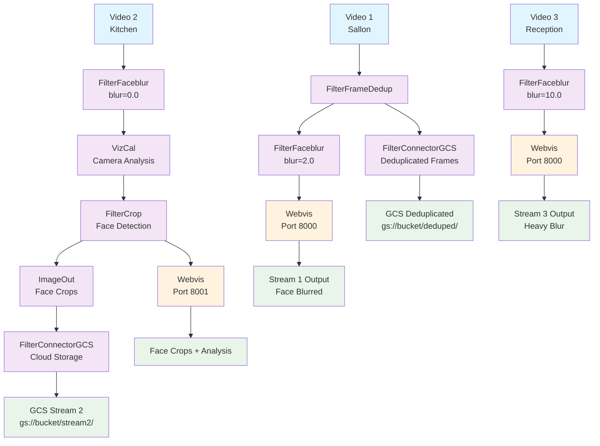
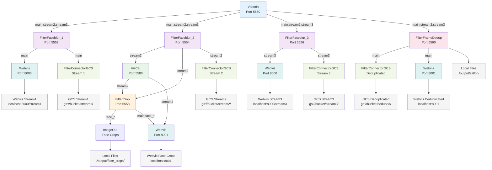
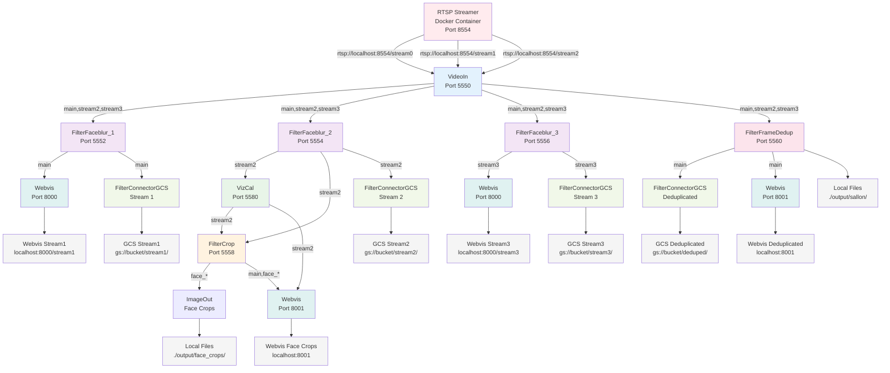
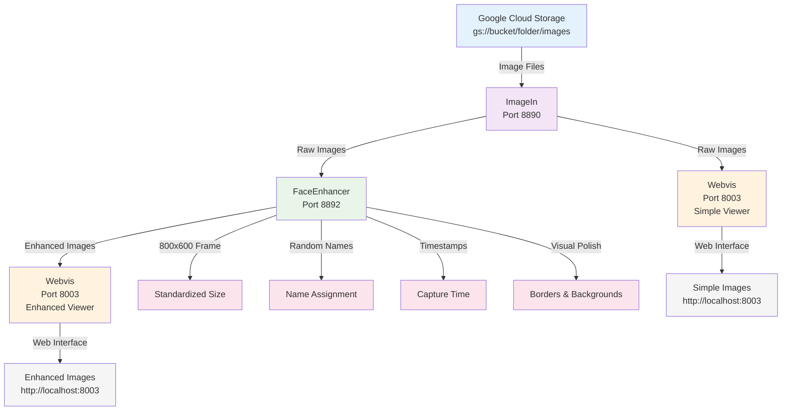

# Video Pipeline Demo

This example demonstrates a comprehensive video processing pipeline using OpenFilter with multiple filters working together to process three video streams in parallel, featuring face detection, camera analysis, frame deduplication, and cloud storage integration.

## What does it do?

This example is complete and ready to run! It includes:
- ✅ Complete pipeline script (`main.py`)
- ✅ Multi-stream video processing (3 streams)
- ✅ Face detection and blurring with different intensities
- ✅ Camera stability analysis (VizCal)
- ✅ Face cropping and image saving
- ✅ Frame deduplication
- ✅ Google Cloud Storage integration
- ✅ Real-time web visualization
- ✅ All configuration files and documentation

## Pipeline Overview

The demo showcases a sophisticated video processing pipeline with three parallel streams:

**Stream 1 (Sallon - Face Blurred):**
```
VideoIn → FilterFaceblur (blur=2.0) → Webvis
```

**Stream 2 (Kitchen - Analysis & Cropping):**
```
VideoIn → FilterFaceblur (blur=0.0) → VizCal → FilterCrop → ImageOut + Webvis + GCS
```

**Stream 3 (Reception - Heavy Blur):**
```
VideoIn → FilterFaceblur (blur=10.0) → Webvis
```

**Deduplication Stream:**
```
VideoIn → FilterFrameDedup → GCS
```

## Features

- **Multi-Stream Processing**: Processes three video streams simultaneously with different configurations
- **Dual Input Modes**: Support for both local video files and RTSP streams
- **RTSP Integration**: Seamless integration with RTSP streamer for live video processing
- **Face Detection & Blurring**: Automatically detects and blurs faces with configurable intensities
- **Camera Analysis**: Real-time camera stability analysis using VizCal filter
- **Face Cropping**: Extracts cropped images from detected faces with automatic saving
- **Frame Deduplication**: Reduces redundant frames using hash, motion, and SSIM detection
- **Cloud Storage**: Automatic upload to Google Cloud Storage with organized folder structure
- **Real-time Visualization**: Web interface to view all processed streams
- **Multi-Format Output**: Saves images in PNG format with compression
- **Interactive Setup**: Easy-to-use script for getting started

## Quick Start

### Prerequisites

1. Install OpenFilter and required filters:
```bash
# Install from the openfilter package index
make install
```

2. The video files:
The video files should live in [./data](./data)

3. Set up RTSP Streamer (optional, for RTSP mode):
```bash
# Prerequisites: Docker must be installed and running
# Uses published image: us-west1-docker.pkg.dev/plainsightai-prod/oci/rtsp-streamer:1.1.0
# The RTSP streamer will automatically use videos from ./data
# No additional setup required - just run make rtsp-start
```

4. Set up Google Cloud Storage (optional):
```bash
# Set GCS environment variables
export GCS_BUCKET="your-bucket-name"
export GCS_PATH="video-pipeline-demo"
export SEGMENT_DURATION="0.2"
export IMAGE_DIRECTORY="./output/sallon"
```

5. Test the installation:
```bash
python test_pipeline.py
```

### Running the Demo

#### Option 1: Interactive Setup (Recommended)
```bash
# Run the interactive setup script
./start_rtsp_demo.sh
```

#### Option 2: Command Line

**With Local Video Files:**
```bash
# Basic usage with default video files
python main.py

# Or use the new RTSP-enabled script
python main_rtsp.py --mode files

# With custom video files and GCS settings
VIDEO1_PATH=path/to/sallon.mp4 VIDEO2_PATH=path/to/kitchen.mp4 VIDEO3_PATH=path/to/reception.mp4 \
GCS_BUCKET=your-bucket GCS_PATH=video-demo python main_rtsp.py --mode files
```

**With RTSP Streams:**
```bash
# Start RTSP streamer with videos from ./data (uses published image)
make rtsp-start

# Check RTSP streamer status
make rtsp-status

# Run pipeline with RTSP streams
python main_rtsp.py --mode rtsp

# Or with custom RTSP URLs
python main_rtsp.py --mode rtsp --rtsp-urls "rtsp://localhost:8554/stream0,rtsp://localhost:8554/stream1,rtsp://localhost:8554/stream2"

# Stop RTSP streamer when done
make rtsp-stop
```

#### Option 3: Makefile Commands
```bash
# Show all available commands
make help

# Run with local files
make run-files

# Run with RTSP streams (start streamer first)
make rtsp-start
make run-rtsp
make rtsp-stop

# Check RTSP streamer status
make rtsp-status
```

### Viewing Results

#### Web Visualization
Open your browser and navigate to:

**Main Streams (Port 8000):**
- **Stream 1 (Sallon)**: http://localhost:8000/stream1 - Face blurred (blur=2.0)
- **Stream 2 (Kitchen)**: http://localhost:8000/stream2 - Face detection + VizCal analysis
- **Stream 3 (Reception)**: http://localhost:8000/stream3 - Heavy face blur (blur=10.0)

**Face Crops & Analysis (Port 8001):**
- **Face Crops**: http://localhost:8001 - All cropped face images
- **Stream2 Analysis**: http://localhost:8001/stream2_info - Camera stability analysis

#### Local File Outputs
- **Face Crops**: `./output/face_crops/` - Individual cropped face images (PNG format)
- **Deduplicated Frames**: `./output/sallon/` - Deduplicated video frames

#### Google Cloud Storage
If GCS is configured, videos are uploaded to:
- `gs://{bucket}/{path}/stream1/` - Stream 1 videos
- `gs://{bucket}/{path}/stream2/` - Stream 2 videos (with analysis)
- `gs://{bucket}/{path}/stream3/` - Stream 3 videos

## Configuration

### Environment Variables

| Variable | Default | Description |
|----------|---------|-------------|
| `VIDEO1_PATH` | `sample_video1.mp4` | Path to sallon video file |
| `VIDEO2_PATH` | `sample_video2.mp4` | Path to kitchen video file |
| `VIDEO3_PATH` | `sample_video3.mp4` | Path to reception video file |
| `GCS_BUCKET` | `None` | Google Cloud Storage bucket name |
| `GCS_PATH` | `video-pipeline-demo/deduplicated-frames` | GCS path prefix |
| `SEGMENT_DURATION` | `0.2` | Video segment duration for GCS upload |
| `IMAGE_DIRECTORY` | `./output/sallon` | Local directory for images |

#### VizCal Configuration
| Variable | Default | Description |
|----------|---------|-------------|
| `FILTER_CALCULATE_CAMERA_STABILITY` | `True` | Enable camera stability analysis |
| `FILTER_CALCULATE_VIDEO_PROPERTIES` | `True` | Enable video properties calculation |
| `FILTER_CALCULATE_MOVEMENT` | `False` | Enable movement detection |
| `FILTER_SHAKE_THRESHOLD` | `5` | Camera shake detection threshold |
| `FILTER_MOVEMENT_THRESHOLD` | `1.0` | Movement detection threshold |
| `FILTER_FORWARD_UPSTREAM_DATA` | `True` | Forward data from upstream filters |
| `FILTER_SHOW_TEXT_OVERLAYS` | `True` | Show analysis overlays on video |

### Filter Configuration

The pipeline uses the following filter configurations:

#### FilterFaceblur (Per Stream)
- **Stream 1 (Sallon)**: Blur strength 2.0, face detection enabled
- **Stream 2 (Kitchen)**: Blur strength 0.0 (detection only), face detection enabled
- **Stream 3 (Reception)**: Blur strength 10.0, face detection enabled
- **Detector**: YuNet face detection model
- **Confidence Threshold**: 0.3 (lower = detect more faces)
- **Face Coordinates**: Included for cropping

#### FilterCrop
- **Detection Key**: `detections`
- **Detection Class Field**: `class`
- **Detection ROI Field**: `rois`
- **Output Prefix**: `face_`
- **Topic Mode**: `all` (processes all topics)

#### FilterFrameDedup
- **Hash Threshold**: 5 (lower = more sensitive)
- **Motion Threshold**: 1200 (lower = more sensitive)
- **SSIM Threshold**: 0.90 (lower = more dissimilar)
- **Min Time Between Frames**: 1.0 seconds
- **Save Images**: True (saves to `./output/sallon/`)
- **Forward Deduped Frames**: True

#### VizCal (Stream 2 Only)
- **Camera Stability**: Enabled (shake threshold: 5)
- **Video Properties**: Enabled
- **Movement Detection**: Disabled
- **Text Overlays**: Enabled
- **Multi-topic Processing**: Supported

#### FilterConnectorGCS
- **Multiple Sources**: Streams 1, 2, and 3
- **Organized Output**: Separate folders per stream
- **Segment Duration**: 0.2 seconds
- **Debug Mode**: Enabled

## Output

The pipeline generates multiple types of outputs:

### 1. Web Visualization
- **Main Streams**: Real-time display of all three processed streams
- **Face Crops**: Individual cropped face images with analysis overlays
- **Camera Analysis**: Real-time camera stability metrics for Stream 2

### 2. Local File Outputs
- **Face Crops**: `./output/face_crops/` - Individual cropped face images (PNG format)
- **Deduplicated Frames**: `./output/sallon/` - Deduplicated video frames with timestamps

### 3. Google Cloud Storage (if configured)
- **Stream 1**: `gs://{bucket}/{path}/stream1/` - Sallon videos (face blurred)
- **Stream 2**: `gs://{bucket}/{path}/stream2/` - Kitchen videos (with VizCal analysis)
- **Stream 3**: `gs://{bucket}/{path}/stream3/` - Reception videos (heavily blurred)

### 4. Real-time Analysis Data
- **Camera Stability**: Shake distance, stability category
- **Video Properties**: Frame dimensions, FPS, quality metrics
- **Face Detection**: Bounding boxes, confidence scores
- **Deduplication Metrics**: Hash similarity, motion detection

## Pipeline Architecture


### Simplified Diagram - High Level



### Filter Pipeline Implementation



## Use Cases

This pipeline is ideal for:

- **Multi-Camera Surveillance**: Process multiple camera feeds with different privacy settings
- **Privacy Protection**: Automatically blur faces with configurable intensities
- **Camera Analysis**: Monitor camera stability and video quality in real-time
- **Content Analysis**: Extract keyframes and face regions from video content
- **Storage Optimization**: Reduce storage by deduplicating similar frames
- **Cloud Integration**: Automatically upload processed videos to cloud storage
- **Real-time Processing**: Process live video streams with multiple filters
- **A/B Testing**: Compare different processing approaches on the same video

## RTSP Mode

The pipeline supports both local video files and RTSP streams, allowing you to process live video feeds or pre-recorded videos through an RTSP server.

### RTSP Architecture



### Running RTSP Mode

#### Quick Start
```bash
# 1. Start RTSP streamer (uses published Docker image)
make rtsp-start

# 2. Run pipeline with RTSP streams (bucket name automatically set)
make run-rtsp

# 3. Stop when done
make rtsp-stop
```

#### Step-by-Step Process

**Step 1: Start RTSP Streamer**
```bash
# This will:
# - Pull the published Docker image: us-west1-docker.pkg.dev/plainsightai-prod/oci/rtsp-streamer:1.1.0
# - Mount videos from ./data directory
# - Start RTSP server on port 8554
# - Start web interface on port 8888
make rtsp-start
```

**Step 2: Verify RTSP Streams**
```bash
# Check if RTSP streamer is running
make rtsp-status

# Test RTSP streams manually (optional)
ffplay rtsp://localhost:8554/stream0
ffplay rtsp://localhost:8554/stream1
ffplay rtsp://localhost:8554/stream2
```

**Step 3: Run Pipeline**
```bash
# Run pipeline with RTSP streams
# GCS_BUCKET is automatically set to protege-artifacts-development
make run-rtsp
```

**Step 4: View Results**
- **Main Streams**: http://localhost:8000
- **Face Crops**: http://localhost:8001
- **RTSP Web Interface**: http://localhost:8888

**Step 5: Clean Up**
```bash
# Stop RTSP streamer
make rtsp-stop
```

#### Interactive Setup
```bash
# Use the interactive script for guided setup
./start_rtsp_demo.sh

# Choose option 3 to start RTSP streamer
# Choose option 2 to run pipeline with RTSP
# Choose option 5 to check status
```

#### Custom RTSP URLs
```bash
# Use custom RTSP URLs
python main_rtsp.py --mode rtsp --rtsp-urls "rtsp://your-server:8554/stream0,rtsp://your-server:8554/stream1,rtsp://your-server:8554/stream2"
```

### RTSP Configuration

The RTSP streamer uses the following configuration:
- **Docker Image**: `us-west1-docker.pkg.dev/plainsightai-prod/oci/rtsp-streamer:1.1.0`
- **RTSP Port**: 8554
- **Web Interface Port**: 8888
- **Video Source**: `./data` directory (mounted as `/data/videos` in container)
- **Stream Names**: `stream0`, `stream1`, `stream2`
- **Loop Mode**: Enabled (videos loop continuously)

### RTSP vs Local Files

| Feature | Local Files | RTSP Streams |
|---------|-------------|--------------|
| **Video Source** | Direct file access | RTSP server |
| **Setup** | No additional setup | Requires Docker |
| **Performance** | Faster startup | Slight overhead |
| **Flexibility** | Limited to local files | Any RTSP source |
| **Scalability** | Single machine | Distributed |
| **Use Cases** | Development, testing | Production, live feeds |

### Troubleshooting RTSP Mode

1. **RTSP streamer not starting**: Check Docker is running
2. **No video streams**: Verify videos are in `./data` directory
3. **Connection refused**: Check ports 8554 and 8888 are available
4. **Platform warning**: Normal on ARM Macs, doesn't affect functionality
5. **Pipeline can't connect**: Ensure RTSP streamer is running before starting pipeline

## Testing the Demo

### 1. Web Visualization Testing
- **Main Interface**: Visit http://localhost:8000 to see all three streams
- **Face Crops**: Visit http://localhost:8001 to see cropped face images
- **Analysis Overlay**: Check Stream 2 for camera stability analysis overlays

### 2. File Output Testing
```bash
# Check face crops are being saved
ls -la ./output/face_crops/

# Check deduplicated frames
ls -la ./output/sallon/

# Monitor real-time file creation
watch -n 1 'ls -la ./output/face_crops/ | tail -5'
```

### 3. GCS Output Testing (if configured)
```bash
# List uploaded videos
gsutil ls gs://your-bucket/video-pipeline-demo/

# Check specific stream folders
gsutil ls gs://your-bucket/video-pipeline-demo/stream1/
gsutil ls gs://your-bucket/video-pipeline-demo/stream2/
gsutil ls gs://your-bucket/video-pipeline-demo/stream3/
```

### 4. Performance Monitoring
- **CPU Usage**: Monitor system resources during processing
- **Memory Usage**: Check for memory leaks with large videos
- **Network**: Monitor GCS upload bandwidth usage

## Troubleshooting

### Common Issues

1. **Video files not found**: Ensure video files exist and paths are correct
2. **Port conflicts**: Make sure ports 8000, 8001, and 8554 are available
3. **Memory issues**: Large video files may require more memory
4. **GCS upload failures**: Check GCS credentials and bucket permissions
5. **Face detection not working**: Ensure OpenCV models are downloaded
6. **VizCal analysis missing**: Check that Stream 2 has video content
7. **RTSP connection failed**: Ensure RTSP streamer is running (`make rtsp-start`)
8. **RTSP streams not available**: Check that videos are in ./data directory
9. **Docker not running**: RTSP streamer requires Docker to be installed and running
10. **Platform warning**: You may see a platform warning (linux/amd64 vs linux/arm64) - this is normal and doesn't affect functionality
11. **RTSP port conflicts**: Ensure ports 8554 and 8888 are available for RTSP streamer

### Debug Mode

Enable debug logging by modifying the filter configurations in `main.py`:
```python
"debug": True,  # Enable for FilterFrameDedup, FilterFaceblur, and FilterConnectorGCS
```

## GCS Image Enhancement Pipeline

### ImageIn Pipeline Architecture



### Performance Tuning

- **Reduce blur strength** for better performance
- **Increase deduplication thresholds** to reduce processing
- **Disable VizCal analysis** if not needed
- **Use smaller video segments** for GCS uploads
